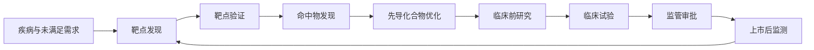
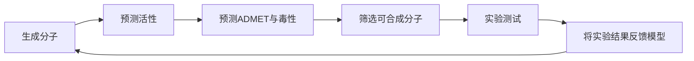
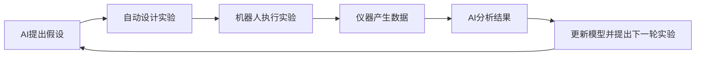

---
tags:
  - 生物
  - AI制药
---

> AI 不是单独替代某个科学家，而是嵌入药物研发的多个环节，用来缩小搜索空间、预测结果、安排实验和整合证据。真正的药物仍需经过实验、毒理和临床验证。

## 一、完整流程

传统研发从靶点到上市通常需要多年，失败率很高。**AI 主要帮助每一步更快地产生和筛选候选方案**，但每一步都需要不同类型的实验确认。

## 二、确定疾病问题

研发首先要明确：

- 治疗什么疾病；
- 哪类患者最需要新疗法；
- 目标是治愈、延缓进展，还是改善症状；
- 需要改变哪个病理过程；
- 什么指标可以证明有效。

AI 可以分析：

- 流行病学数据；
- 电子健康记录；
- 临床试验结果；
- 患者基因组；
- 医学文献；
- 医疗影像和病理图像。

例如，**AI 可能发现某种基因变异只在特定患者亚群中出现，于是研发方向从“治疗所有患者”变成“针对携带该变异的患者开发药物”**。

这一步决定了后续靶点和临床人群。

## 三、靶点发现：寻找应该干预的生物节点

靶点可以是：

- 蛋白质；
- 酶；
- 受体；
- 离子通道；
- RNA；
- DNA 或基因调控区域；
- 代谢过程或细胞信号通路。

AI 在这里主要做四件事。

### 1. 从文献中建立疾病机制图

模型提取：

- 哪些基因与疾病有关；
- 哪些蛋白质互相作用；
- 哪些通路反复出现在研究中；
- 哪些关系有实验支持；
- 哪些关系只是相关性。

### 2. 融合多组学数据

常见数据包括：

- 基因组；
- 转录组；
- 蛋白质组；
- 磷酸化组；
- 单细胞数据；
- 表观遗传数据；
- 代谢组；
- 蛋白质互作网络。

AI 可以寻找“多个数据层同时支持”的候选靶点。例如，一个蛋白质可能没有显著表达变化，但其磷酸化状态、互作关系和疾病细胞类型都发生变化。单看一种数据容易漏掉它，多组学模型可能把它排到前面。

### 3. 预测因果关系

模型会尝试区分：

- 只是与疾病一起出现的分子；
- 真正推动疾病发展的分子；
- 可能是结果而非原因的分子。

这一步仍然很难，因为观察数据通常只能提示关联，不能完全证明因果。

### 4. 排序候选靶点

AI 会根据多种证据给出优先级，例如：

- 疾病关联强度；
- 人体遗传学证据；
- 细胞和动物实验；
- 是否存在可结合口袋；
- 是否容易选择性调节；
- 预期毒性；
- 是否已有可利用的化合物。

**“荀子”属于这一阶段的典型系统：它用文献推理和多组学融合，提出并排序候选靶点。**

## 四、靶点验证：证明“动它”真的有用

这是从预测走向科学证据的关键一步。

研究人员会通过以下方式干预靶点：

- siRNA 或 shRNA 降低表达；
- CRISPR 敲除或编辑；
- 过表达目标基因；
- 小分子抑制剂；
- 抗体阻断；
- 蛋白质降解技术；
- 基因疗法或 RNA 药物。

然后观察：

- 细胞是否恢复；
- 疾病表型是否减轻；
- 动物症状是否改善；
- 目标机制是否按预期变化；
- 是否出现严重毒性。

在文章的例子中，AI 提出 CHK2 后，研究人员先在细胞中用 siRNA 验证，再在两种帕金森病小鼠模型中使用基因抑制和 CCT241533 抑制剂。这就是典型的“AI 提出假设、实验验证假设”。

## 五、命中物发现：寻找能作用于靶点的分子

确定靶点后，要找到能与它结合或调节它的“命中物”（hit）。

传统方式包括：

- 大规模化合物筛选；
- 片段筛选；
- 虚拟筛选；
- 天然产物筛选；
- 抗体库筛选。

AI 的作用包括：

### 1. 结构预测

根据氨基酸序列预测蛋白质三维结构，帮助寻找：

- 活性位点；
- 药物结合口袋；
- 蛋白质界面；
- 可能的变构位点。

### 2. 虚拟筛选

AI 预测数百万种化合物中哪些可能与靶点结合，再优先安排实验。

### 3. 分子生成

模型可以根据目标口袋生成新的分子结构，要求它同时满足：

- 能够结合靶点；
- 具有一定选择性；
- 分子性质合适；
- 能被合成；
- 不能过于容易产生毒性。

### 4. 蛋白质或抗体设计

对于抗体、蛋白质药物和肽类药物，AI 可以优化：

- 结合能力；
- 稳定性；
- 特异性；
- 免疫原性；
- 表达和生产性能。

**需要注意：结构预测不等于真实结合。最终仍需通过生化实验、晶体学、冷冻电镜或其他实验验证。**

## 六、先导优化：把“能结合”变成“可开发的药物”

最初的命中物通常问题很多：

- 活性不够强；
- 选择性差；
- 溶解度低；
- 不易吸收；
- 代谢太快；
- 难以穿过血脑屏障；
- 对肝脏或心脏有毒性；
- 化学合成困难。

**AI 会预测和优化所谓的 ADMET 属性：**

- **吸收（Absorption）；**
- **分布（Distribution）；**
- **代谢（Metabolism）；**
- **排泄（Excretion）；**
- **毒性（Toxicity）。**

典型流程是：

这形成“设计—合成—测试—学习”的循环。模型每轮根据实验结果更新，逐渐提高分子质量。

AI 可以把原本一次只尝试少数化合物的流程，变成每轮更有针对性地设计一批分子。

## 七、临床前研究：从分子到候选药物

当一个候选药物初步成熟后，要进行：

- 药效研究；
- 药代动力学；
- 组织分布；
- 剂量探索；
- 急性和长期毒性；
- 生殖毒性；
- 遗传毒性；
- 与其他药物的相互作用；
- 制剂和稳定性研究。

AI 可以帮助：

- 预测合适剂量；
- 建立药代模型；
- 识别毒性信号；
- 选择更合适的动物实验；
- 分析病理切片和组织图像；
- 预测哪些患者可能获益。

**但 AI 不能跳过监管要求。药物必须提供可重复、可审计的实验数据。**

## 八、临床试验：验证对人是否有效、安全

临床试验通常分为：

| 阶段 | 主要问题 |
| --- | --- |
|I 期|对健康人或少量患者是否安全，耐受剂量是多少|
|II 期|对目标疾病是否初步有效，剂量如何选择|
|III 期|在更大人群中是否优于现有治疗，风险收益是否可接受|
|IV 期|上市后长期安全性和罕见副作用|

AI 可以参与：

- 选择入组患者；
- 预测患者是否可能响应；
- 设计试验方案；
- 寻找合适剂量；
- 识别临床终点；
- 提高患者招募效率；
- 监测不良事件；
- 分析真实世界数据；
- 预测脱落和依从性。

尤其是在精准医疗中，AI 可以帮助确定“什么药适合什么人”，而不是只寻找一个对所有人平均有效的药。

## 九、生产和上市后阶段

AI 制药并不止于发现分子。

### 生产阶段

AI 可以优化：

- 合成路线；
- 反应条件；
- 原料选择；
- 工艺稳定性；
- 质量控制；
- 批次差异；
- 生产成本。

### 上市后阶段

AI 可以持续分析：

- 不良事件报告；
- 电子病历；
- 用药依从性；
- 不同人群的疗效；
- 罕见副作用；
- 新适应症线索。

一种药上市后，可能被发现对另一种疾病也有帮助，这叫 **药物再利用**。AI 可以通过疾病—靶点—药物网络寻找这类机会。

## 十、AI 在整个流程中最擅长什么

可以归纳为五种能力：

### 1. 处理规模

人类无法逐篇阅读数千万篇论文，也无法手动比较数百万种分子。AI 可以快速处理大规模数据。

### 2. 发现组合关系

AI 能把不同来源的信息放在一起，寻找跨基因、蛋白质、通路和疾病的联系。

### 3. 进行预测

例如预测：

- 哪个靶点更值得验证；
- 哪个分子可能结合；
- 哪个候选物可能有毒；
- 哪类患者可能响应。

### 4. 生成候选方案

模型可以生成：

- 新分子；
- 蛋白质序列；
- 抗体变体；
- 实验方案；
- 临床试验设计；
- 合成路线。

### 5. 优化实验顺序

不是把所有实验都做一遍，而是优先做信息价值最高的实验，尽快淘汰错误方向。

## 十一、AI 最不擅长、也最容易被误解的地方

### “相关”不等于“因果”

某个分子在疾病组织中升高，不代表抑制它就能治疗疾病。

### 预测结构不等于真实药效

分子可能在计算机里结合得很好，但在真实细胞中进不去、被代谢掉，或无法达到足够浓度。

### 小鼠有效不等于人有效

动物模型只模拟疾病的一部分。帕金森病小鼠运动改善，不能直接推出患者也会改善。

### 生成新分子不等于能制造

AI 设计的分子可能难以合成、难以纯化或无法稳定生产。

### 数据越多不一定越可靠

数据可能存在：

- 批次差异；
- 样本偏差；
- 标签错误；
- 研究热点偏差；
- 未研究对象被误标为负样本；
- 不同实验平台之间不可比。

### 解释看起来合理也可能是错的

语言模型生成的机制链条可能流畅，但某个环节并没有真正的实验依据。

## 十二、为什么“全自动 AI 科学家”还没有成为现实

理想状态是：

这叫闭环或自动化实验平台。

目前已有部分系统能做到：

- AI 设计实验；
- 机器人执行部分实验；
- 自动读取仪器数据；
- 模型根据结果安排下一轮。

但离完全自动化还有障碍：

- 生物实验具有高度不确定性；
- 不同实验室结果可能不一致；
- 许多关键现象难以标准化；
- 失败实验也需要专家解释；
- 安全、伦理和监管责任不能完全交给模型；
- 真实疾病机制通常比训练数据复杂。

因此，当前最可靠的模式仍是：

> AI 扩大假设空间和筛选能力，人类科学家负责问题定义、实验设计、结果判断和责任承担。

相关笔记：[[药物是怎么作用的？]]　·　[[AlphaFold 在 AI 制药中的位置]]　·　[[Rosetta 在 AI 制药中的位置]]　·　[[GPT-Rosalind：开启生命科学研究新纪元]]
