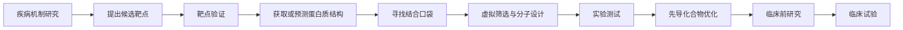

---
tags:
  - 生物
  - AI制药
  - AlphaFold
---

> **AlphaFold 在 AI 制药中的核心作用，是为药物研发提供“蛋白质三维地图”，帮助研究人员判断药物可以从哪里、以什么方式作用于靶点。**

它主要解决的是“**药怎么设计**”，而不是单独解决“**这个靶点是不是真的有效**”。

可以把药物研发想成攻城：

- 疾病靶点是要攻克的城；
- 靶点蛋白质是城里的机器或城门；
- 药物是用来关闭机器、堵住城门的工具；
- AlphaFold 提供的是这座城的建筑地图。

有了地图，设计工具会容易很多；但地图本身不能证明“攻下这座城就能治病”。

## 先区分两个问题：找靶点和做药

假设科学家怀疑蛋白质 X 参与帕金森病。

第一个问题是：

> 如果抑制 X，神经元会不会得到保护？

这叫**靶点验证**。可以用：

- siRNA 降低 X 的表达；
- CRISPR 敲除 X；
- 抗体阻断 X；
- 已有抑制剂抑制 X；
- 在细胞和小鼠中观察疾病表型。

这个阶段不一定知道 X 的三维结构。

第二个问题是：

> **怎样设计一个真正能抑制 X、而且安全、有效、能进入人体的药物？**

这时结构信息就非常重要。研究人员需要知道：

- **药物应该结合作为疾病干预对象的靶点蛋白质上的哪个具体部位。**
- 这个位置是否有足够大的口袋；
- 哪些氨基酸决定结合；
- 怎样只结合 X，而不影响相似蛋白；
- 药物怎样提高结合强度；
- 某个突变会不会导致耐药。

AlphaFold 主要帮助第二个问题。

## AlphaFold 到底预测什么

**蛋白质由一串氨基酸组成。氨基酸序列就像一串字母，但蛋白质要真正发挥作用，必须折叠成特定的三维形状。AlphaFold 主要根据靶点蛋白质的氨基酸序列，预测它可能的三维结构**

AlphaFold 的输入通常是：

> 一条蛋白质氨基酸序列。

输出则是：

> 这条序列可能折叠成什么样的三维结构，以及模型对各部分预测有多大把握。

结构中可能包括：

- 螺旋；
- 折叠片层；
- 环状区域；
- 活性中心；
- 分子结合口袋；
- 蛋白质互相接触的表面；
- 某些突变所在的位置。

过去，研究人员往往要通过 X 射线晶体学、冷冻电镜或核磁共振来测量蛋白质结构。这些方法非常重要，但可能需要数月甚至更久，而且有些蛋白质很难被实验解析。

AlphaFold 可以先给出一个计算模型，让研究团队快速获得初步结构信息。

## 它在完整制药流程中的位置

AlphaFold 的作用主要集中在 **D 到 H**，也就是结构分析、命中物发现和先导优化阶段。它也会间接帮助前面的靶点判断，但不是靶点有效性的最终证据。

下面按整个流程说明。

### 1. 疾病机制研究：帮助理解蛋白质可能做什么

在最早阶段，研究人员可能只知道：

- 某个基因在患者中发生突变；
- 某个蛋白质在病变组织中数量异常；
- 某条信号通路被激活；
- 某种蛋白质和疾病严重程度有关。

AlphaFold 可以帮助把这些现象放到结构层面理解。

例如：

- 突变是否位于蛋白质活性中心；
- 突变是否破坏蛋白质内部稳定性；
- 突变是否位于蛋白质相互作用界面；
- 某段蛋白质是否可能负责结合 DNA、RNA 或其他蛋白。

假设某个癌症相关突变位于蛋白质的“开关区域”，结构模型可能帮助研究人员推测：

> 这个突变也许让蛋白质长期处于开启状态。

这会形成一个值得实验验证的机制假设。

但要注意，结构模型只能帮助解释“可能为什么如此”，不能单凭结构证明突变一定导致癌症。

### 2. 靶点发现：间接判断它是否“值得做成药”

靶点发现主要看疾病因果关系，而不是外形。

研究人员要问：.

> 改变这个蛋白质，是否真的能改善疾病？

AlphaFold 可以间接帮助判断靶点是否具有“可成药性”。

所谓可成药性，通俗说就是：

> 这个蛋白质有没有可以被药物抓住、调节或阻断的地方？

例如，一个候选蛋白质可能确实参与疾病，但它的表面非常平，没有明显口袋。这样的小分子药物可能很难结合。

另一个蛋白质可能有：

- 深而稳定的结合口袋；
- 明确的活性中心；
- 容易被抗体识别的表面；
- 可以通过变构方式调节的区域。

后者通常更适合进入药物开发。

所以 AlphaFold 可以帮助回答：

- 这个靶点有没有潜在结合位置；
- 结合位置是否靠近功能区域；
- 是否存在适合小分子或抗体的表面；
- 这个靶点是否可能通过结构方式被调节。

但它不能回答：

> 抑制这个蛋白质后，患者会不会真的好转。

这仍然要靠细胞、动物和临床实验。

### 3. 靶点验证：帮助设计验证工具

靶点验证时，AlphaFold 不是主角，但可以辅助设计实验。

比如研究人员想制作一个抗体来阻断蛋白质 X，需要先知道：

- 抗体应该识别蛋白质哪个表面；
- 哪个区域暴露在细胞外；
- 哪些部位与受体结合；
- 哪些部位不能被遮挡，否则可能没有效果。

如果要设计一个实验用小分子探针，结构模型也能帮助判断：

- 哪个口袋可能适合结合；
- 哪些氨基酸应该重点突变；
- 哪些突变能检验结合是否真实；
- 如何设计“失活突变”作为对照。

例如，研究人员可以预测某个小分子应该与蛋白质的三个氨基酸接触，再把其中一个氨基酸改掉。如果药物结合能力明显下降，就能支持模型提出的结合方式。

所以，这里 AlphaFold 的作用是：

> 帮助实验人员设计更有针对性的验证，而不是替代验证。

### 4. 命中物发现：这是 AlphaFold 最直接的用途之一

确定靶点后，研发团队要寻找能够作用于它的分子。最早找到的有效分子叫“命中物”。

传统方法可能是：

- 准备大量化合物；
- 一个个与靶点做实验；
- 找到少数有作用的分子；
- 再研究它们怎么结合。

这相当于有一大串钥匙，逐把插进锁里尝试。

如果知道蛋白质结构，就可以先查看“锁孔”形状，筛掉明显不合适的钥匙。

AlphaFold 可以支持：

#### 结构基础虚拟筛选

让计算机模拟大量化合物是否可能进入蛋白质口袋，优先测试评分较高的分子。

#### 分子对接

预测某个化合物怎样摆放在蛋白质口袋中，哪些化学基团可能形成相互作用。

#### 口袋识别

寻找蛋白质表面的凹槽、空腔或隐藏的结合区域。

#### 变构位点发现

有些药物不堵住蛋白质的主活性中心，而是结合到旁边的位置，改变蛋白质形状。这些位置叫变构位点，结构模型可能帮助发现它们。

#### 蛋白质—蛋白质相互作用分析

有些疾病靶点不是单独工作的，而是和另一种蛋白质结合。结构模型可以帮助寻找两者接触的界面，再设计阻断剂。

但是，虚拟筛选只是预测。真正的结合仍需用实验测量，例如：

- 表面等离子共振；
- 等温滴定量热法；
- 生化活性实验；
- 细胞功能实验。

### 5. 蛋白质药物和抗体设计：AlphaFold 也很重要

药物不一定是小分子，也可能是：

- 抗体；
- 蛋白质配体；
- 酶；
- 肽；
- 疫苗抗原；
- 蛋白质降解工具。

这类药物需要知道两个结构：

1. 靶点蛋白质的结构；
2. 药物本身的结构。

AlphaFold 可以帮助预测：

- 抗体和抗原可能怎样结合；
- 蛋白质药物是否会形成正确结构；
- 蛋白质复合物的接触界面；
- 哪些位置可以修改而不破坏整体稳定性。

例如，要做一个只识别肿瘤细胞表面蛋白的抗体，研究人员需要设计一个结合区域，使它：

- 紧紧抓住目标蛋白；
- 尽量不结合正常细胞中的类似蛋白；
- 保持稳定；
- 不容易引起不必要的免疫反应。

结构预测可以帮助提出初始设计，但最终还必须表达、纯化并进行结合和细胞实验。

### 6. 先导化合物优化：帮助把“有效”变成“好药”

找到命中物后，通常还远远不够。它可能存在：

- 结合能力不够强；
- 选择性不够好；
- 溶解度太低；
- 太容易被肝脏代谢；
- 进入不了细胞；
- 无法穿过血脑屏障；
- 对其他蛋白质产生脱靶作用；
- 产生心脏、肝脏或神经毒性。

这时研究人员会不断修改分子结构。

AlphaFold 以及相关结构模型可以帮助预测：

- 修改哪个位置可能增强结合；
- 哪些化学基团伸入口袋后会产生冲突；
- 如何填满口袋中的空隙；
- 如何避免与相似蛋白质结合；
- 某种耐药突变会让药物失效吗；
- 新分子是否仍保持合理的结合姿态。

这是一个循环：

AlphaFold 通常不是单独完成这件事，而是与分子对接、分子动力学、生成模型、ADMET 模型和实验数据一起使用。

### 7. 它如何帮助理解耐药

在癌症、感染和某些遗传病治疗中，药物可能因为突变而失效。

如果目标蛋白质发生突变，可能出现：

- 药物结合口袋变形；
- 药物与关键氨基酸失去接触；
- 蛋白质变得更活跃；
- 其他通路绕开了药物阻断。

AlphaFold 可以帮助模拟某些突变后的结构变化，推测：

- 哪些突变可能导致耐药；
- 哪些新药结构可能避开耐药突变；
- 是否需要同时作用于另一个位点。

不过，耐药通常涉及动态变化和细胞网络，不能只看一张结构图。

### 8. AlphaFold3 比 AlphaFold2 多做了什么

AlphaFold2 主要以蛋白质结构预测闻名。AlphaFold3 进一步尝试预测更复杂的分子复合物，包括：

- 蛋白质与蛋白质；
- 蛋白质与 DNA；
- 蛋白质与 RNA；
- 蛋白质与小分子；
- 蛋白质与离子等。

这对药物研发很有吸引力，因为药物真正作用的通常不是“孤零零的一条蛋白质”，而是：

- 蛋白质和配体形成的复合物；
- 蛋白质和 DNA 的结合；
- 受体和信号分子的复合物；
- 抗体和抗原的复合物。

以前可能只能预测“蛋白质本身长什么样”，现在希望进一步预测：

> 药物靠近后，整个复合物可能怎样排列。

但必须特别注意：

> **预测复合物结构，不等于准确预测结合强度。**

一个分子在结构上看起来能放进结合口袋，不代表它在真实实验中一定结合得牢，也不代表它能进入细胞或产生治疗效果。

### 9. AlphaFold 不负责哪些关键问题

AlphaFold 的边界非常重要。

它不能单独证明：

- 一个蛋白质就是疾病靶点；
- 一个小分子一定有药效；
- 药物能进入人体需要的组织；
- 药物能穿过血脑屏障；
- 药物不会产生毒性；
- 药物不会脱靶；
- 小鼠有效的人也有效；
- 药物适合什么剂量；
- 药物能够被稳定生产；
- 临床试验一定成功。

这些问题分别需要：

- 细胞实验；
- 动物实验；
- 药代动力学；
- 毒理学；
- 组织分布实验；
- 工艺开发；
- 临床试验；
- 监管审查。

AlphaFold 提供的是结构信息，不是完整的药物证据链。

## 一个贯穿全流程的例子

假设研究人员怀疑蛋白质 X 是某种癌症的靶点。

**第一步：提出靶点假设**

他们发现：

- 癌细胞中 X 活性很高；
- 抑制 X 后癌细胞生长变慢；
- 某些患者的 X 基因存在致病突变。

这说明 X 值得进一步研究，但还不能说它已经是有效药物靶点。

**第二步：靶点验证**

研究人员用基因敲低和基因编辑降低 X 的功能，观察：

- 癌细胞是否死亡；
- 正常细胞是否受到严重影响；
- 小鼠肿瘤是否缩小；
- 下游通路是否按预期关闭。

**第三步：获得结构**

**实验结构可能尚未解析，于是使用 AlphaFold 预测 X 的三维结构，发现：**

- 一个可能的活性口袋；
- 一个可能的变构位点；
- 一个与其他蛋白质结合的界面。

**第四步：寻找命中物**

研究人员根据这个口袋筛选几十万种化合物，把最可能结合的几百种拿去实验。

**第五步：实验确认**

如果其中几个分子确实能抑制 X，就测量：

- 结合强度；
- 选择性；
- 细胞活性；
- 脱靶作用。

**第六步：优化分子**

**根据 AlphaFold 和实验结构，研究人员修改分子，使它：**

- 结合更牢；
- 选择性更好；
- 更容易进入癌细胞；
- 更不容易被代谢；
- 更少损伤正常组织。

**第七步：临床前和临床**

之后还要完成药代、毒理、动物疗效和人体临床试验。

这里 AlphaFold 贯穿了“结构理解、命中物发现和分子优化”，但它没有独立完成靶点验证，也没有独立完成药物开发。

## AlphaFold 与“荀子”的区别

你前面提到的“荀子”与 AlphaFold 处于不同位置。

| 系统        | 主要回答的问题                     |
| --------- | --------------------------- |
| “荀子”      | 哪些基因或蛋白质可能参与疾病，哪些候选靶点值得优先验证 |
| AlphaFold | 这些蛋白质可能是什么三维形状，哪里可能与药物结合    |
| 分子生成模型    | 什么样的新分子可能作用于这个结构            |
| 实验系统      | 这些预测在细胞、动物和人体中是否真实有效        |

可以简化成：

因此：

- “荀子”更偏向**疾病机制和靶点优先级**；
- AlphaFold 更偏向**蛋白质结构和药物作用位置**；
- 生成模型更偏向**设计新分子或新蛋白质**；
- 实验和临床负责**确认现实世界效果**。

## 为什么结构信息会大幅提高效率

没有结构时，研究人员也能做药，但往往更依赖：

- 大规模盲筛；
- 偶然发现；
- 反复试错；
- 从实验结果反推结合位置。

有结构后，可以更有针对性地：

- 排除明显不合适的化合物；
- 优先测试可能进入口袋的分子；
- 设计更少但质量更高的候选者；
- 理解某个分子为什么有效或失效；
- 预测哪些修改可能改善药效；
- 解释耐药突变和脱靶作用。

所以 AlphaFold 的价值不是保证成功，而是降低盲目试错的比例。

---

## 还要注意它的局限

蛋白质不是一块静止的石头，而更像一台不断运动的机器。AlphaFold 给出的结构可能存在以下问题：

- 某些蛋白质有多个构象；
- 结合药物后会改变形状；
- 蛋白质需要和其他分子结合才能稳定；
- 某些区域本来就是无序的；
- 膜蛋白和大型复合物可能更难预测；
- 预测置信度在不同区域差异很大；
- 模型可能给出“看起来合理”的错误结构。

研究人员通常会参考两个重要指标：

- **pLDDT：** 某个局部区域预测得有多可靠；
- **PAE：** 不同结构区域之间的相对位置有多可靠。

通俗理解：

- pLDDT 高，表示这个局部形状比较可信；
- pLDDT 低，表示这个区域可能很灵活或预测不稳定；
- PAE 高，表示两个结构域之间怎么相对摆放不太确定。

药物设计不能只看一张漂亮的三维图，还要看模型置信度和实验验证。

---

## 最后用三句话总结

1. **靶点发现**解决的是“该攻击谁”；
2. **AlphaFold**解决的是“这个目标可能长什么样、哪里能下手”；
3. **药物研发**最终还要解决“设计的药能否在人体内安全、有效、可制造”。

因此，AlphaFold 之所以和 AI 制药密切相关，是因为它把蛋白质结构这个过去昂贵、缓慢、常常缺失的环节变得更容易获得，从而帮助后续的药物筛选、设计和优化更快开始、更少盲目试错。

相关笔记：[[AI 制药的整个流程]]　·　[[Rosetta 在 AI 制药中的位置]]
