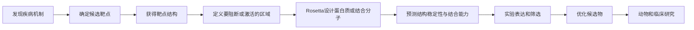
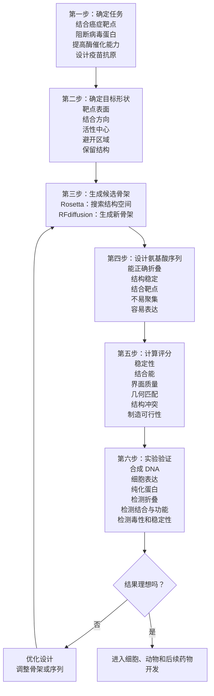
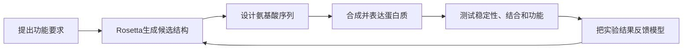
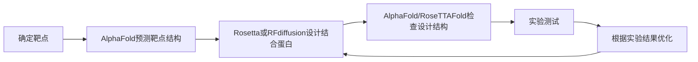

---
tags:
  - 生物
  - AI制药
  - AlphaFold
  - Rosetta
---

> **AlphaFold 主要是“看懂现有蛋白质长什么样”，Rosetta 主要是“根据目标，设计或改造蛋白质，使它具备想要的功能”。**

David Baker 团队的 Rosetta，是 AI 制药中非常重要的**蛋白质结构计算与设计平台**。它尤其适合抗体、蛋白质药物、疫苗抗原、酶和其他生物大分子的研发。

## 先用一个比喻理解

把蛋白质想象成一把特殊工具：

- **AlphaFold**：拿到一串氨基酸，预测它会折叠成什么形状；
- **Rosetta**：提出“我需要一把能完成某种任务的工具”，然后设计它的形状和材料；
- **实验室**：真正把这把工具做出来，测试它是否有效；
- **临床试验**：确认它对人体是否安全、有用。

所以，AlphaFold 更像“结构测绘师”，Rosetta 更像“蛋白质工程师”。

## Rosetta 到底是什么

Rosetta 不是一个单独的聊天模型，也不是单纯的一个神经网络。它更像一个长期发展出来的**计算蛋白质科学平台**，里面有许多不同功能模块。

它可以做：

- 蛋白质结构预测；
- 蛋白质结构精修；
- 蛋白质与蛋白质对接；
- 蛋白质与小分子对接；
- 抗体设计；
- 蛋白质序列设计；
- 蛋白质稳定性优化；
- 酶和催化剂设计；
- 蛋白质复合物建模；
- 蛋白质结合界面优化。

早期 Rosetta 主要依靠物理和统计方法，模拟氨基酸之间的相互作用，寻找能量更低、更稳定的结构。后来 Baker 团队又加入了深度学习和生成模型，例如 **RoseTTAFold**、**RFdiffusion** 等。

因此今天说“Baker 团队的 Rosetta 体系”，通常包含：

- 传统的 Rosetta 计算设计工具；
- RoseTTAFold 等结构预测模型；
- RFdiffusion 等生成式蛋白质设计模型；
- 用实验数据训练和筛选蛋白质的完整流程。

## Rosetta 与 AlphaFold 的关键区别

可以从两个方向理解：

### AlphaFold：从序列到结构

**氨基酸序列 → 预测三维结构**

例如给它一条蛋白质序列，它预测这条序列大概会折叠成什么样。

### Rosetta：从功能要求到结构和序列

**目标功能或目标表面 → 设计蛋白质结构 → 设计氨基酸序列**

例如：

> 我想要一个蛋白质，能够牢牢结合病毒表面的某个区域。

Rosetta 可能尝试设计：

1. 一个合适的蛋白质骨架；
2. 一个面向病毒表面的结合界面；
3. 一组能形成这个形状的氨基酸序列；
4. **由前面设计方案产生、准备接受实验验证的完整蛋白质分子（1,2,3 结合得到的完整蛋白质分子）**

这被称为**逆向蛋白质设计**：不是先有序列再看它是什么，而是先确定想要的功能和形状，再反过来寻找适合的序列。

## Rosetta 在 AI 制药流程中的位置

完整流程可以这样看：

Rosetta 最重要的作用集中在：

- 靶点验证工具设计；
- 蛋白质药物发现；
- 抗体和结合蛋白设计；
- 蛋白质结构优化；
- 候选分子的实验前筛选。

### 1. 设计“能抓住靶点”的蛋白质

假设研究人员已经确认某种癌症相关蛋白是靶点，但它表面没有明显适合小分子结合的口袋。

这时可以考虑设计一个更大的蛋白质或抗体去“抓住”它。

研究人员会先指定：

- 靶点表面的哪个区域；
- 需要阻断什么功能；
- 希望结合得多牢；
- 是否需要避开正常蛋白质；
- 结合蛋白要多大；
- 是否需要能在人体中稳定存在。

Rosetta 会尝试设计一个与目标表面互补的结合界面。

可以把它想象成制作一只手套：

- 靶点是手；
- 设计的蛋白质是手套；
- 形状越匹配，结合通常越好；
- 但手套还必须结实、容易制造，并且不能误套到别人的手上。

这类设计可以用于：

- 抗病毒蛋白；
- 抗肿瘤结合蛋白；
- 细胞因子阻断剂；
- 受体激动剂或拮抗剂；
- 蛋白质降解系统中的识别模块。

### 2. 设计全新的蛋白质骨架

自然界中的蛋白质有限，而且很多天然蛋白并不适合直接作为药物：

- 结构不够稳定；
- 容易聚集；
- 不容易表达；
- 结合位置不理想；
- 免疫原性较高；
- 体内半衰期太短。

Rosetta 可以从头设计自然界原本没有的蛋白质骨架。

例如，研究人员可能希望得到一个：

- 形状紧凑；
- 热稳定性高；
- 只有一个特定结合面；
- 不容易聚集；
- 易于细胞表达；
- 可以连接到其他药物模块；

的人工蛋白质。

Rosetta 先搜索符合这些条件的三维骨架，再为骨架安排氨基酸序列。

这类方法叫 **de novo protein design**，也就是“从头设计蛋白质”。

David Baker 团队早期设计出的人工蛋白质，证明了蛋白质不一定只能从自然界已有的模板中寻找，也可以按照工程目标创造新的结构。

### 3. 设计抗体和抗体替代物

抗体是很重要的药物类型。它们可以识别癌细胞、病毒、炎症因子或其他目标。

Rosetta 可以帮助优化：

- 抗体与抗原的结合界面；
- 抗体的结合强度；
- 对目标的选择性；
- 抗体的稳定性；
- 抗体不同区域的氨基酸序列；
- 避免与相似蛋白质发生脱靶结合。

它也可以设计一些比完整抗体更小的结合蛋白，例如：

- miniprotein；
- nanobody；
- 蛋白质支架；
- 小型受体模拟物。

这些分子有时更容易生产，组织穿透性也可能更好。

### 4. 设计酶和催化剂

很多疾病治疗和生物制造都需要酶。

研究人员可能希望设计一个酶，使它：

- 加速某个化学反应；
- 只识别特定底物；
- 在人体温度和酸碱环境下工作；
- 不产生有害副产物；
- 比天然酶更稳定。

Rosetta 可以模拟活性中心周围的结构，调整关键氨基酸，让底物更容易按照正确方向进入。

在药物研发里，这可能用于：

- 代谢某种有害物质；
- 激活前药；
- 破坏病原体需要的分子；
- 设计新的生物合成路线；
- 生产药物原料。

### 5. 设计疫苗抗原

疫苗需要让免疫系统准确识别病原体的重要部位。

Rosetta 可以帮助设计：

- 更稳定的病毒蛋白；
- 让关键抗原区域暴露出来的结构；
- 多个抗原片段组成的人工支架；
- 能诱导更强免疫反应的蛋白质纳米颗粒。

这类设计的思路是：

> 不一定直接使用病原体原本的蛋白质，而是重新设计一个更适合被免疫系统识别的版本。

### 6. 帮助优化蛋白质药物

一个蛋白质即使能结合靶点，也可能还不能成为药物。

Rosetta 可以尝试优化：

- 结构稳定性；
- 折叠效率；
- 结合亲和力；
- 选择性；
- 抗体的表达量；
- 抗聚集能力；
- 对温度和酸碱变化的耐受性；
- 与其他分子的结合方式。

例如，某个候选蛋白质在实验中容易失活。Rosetta 可以分析它的内部结构，寻找：

- 哪些位置太松散；
- 哪些氨基酸之间缺少稳定相互作用；
- 哪些突变可能让结构更紧；
- 怎样改善整体折叠。

但预测之后仍要真正制造这些突变体，再逐个测试。

### 7. 解释蛋白质之间怎样相互作用

许多药物作用于蛋白质复合物，而不是单个蛋白质。

例如：

- 受体与配体；
- 抗体与抗原；
- 两种信号蛋白；
- 蛋白质与 DNA；
- 蛋白质与 RNA；
- 蛋白质与降解系统。

Rosetta 的对接和界面分析工具可以预测：

- 两个蛋白质怎样贴在一起；
- 哪些氨基酸是关键接触点；
- 改变哪些位置可能增强或削弱结合；
- 怎样设计阻断界面的分子。

这对靶点验证也有帮助。假如研究人员怀疑 CHK2 和 LRRK2 存在调控关系，就可以使用结构建模和界面分析提出更具体的问题：

- 两者是否可能直接接触；
- 哪些氨基酸可能参与接触；
- 改变这些位置后，调控关系是否消失。

## Rosetta 是怎样“设计”蛋白质的

## 为什么它不是“电脑里设计好了，药就完成了”

因为蛋白质设计有一个很大的现实难题：

> 计算机设计的是“可能可行的候选物”，实验才能告诉你它是否真的存在、稳定并发挥作用。

常见失败原因包括：

- 预测的结构实际折叠不出来；
- 蛋白质在细胞中表达量很低；
- 蛋白质容易聚集；
- 结合口袋在真实环境中形状不同；
- 设计的结合界面不够牢；
- 候选蛋白质只在试管里有效；
- 进入人体后被快速清除；
- 引起免疫反应；
- 结合了相似但不该结合的蛋白。

所以 Rosetta 的工作方式不是“一次设计成功”，而是：

> 计算生成许多候选者，再用实验快速筛选，利用实验结果继续改进设计。

这是一种“设计—制造—测试—学习”的循环。

## Rosetta 与小分子药物有什么关系

Rosetta 最出名的是蛋白质设计，但它也可以参与小分子药物研发。

它可以帮助：

- 预测小分子如何与蛋白质结合；
- 比较不同分子的结合姿态；
- 分析蛋白质口袋的柔性；
- 研究蛋白质突变导致的耐药；
- 优化药物与靶点的相互作用；
- 设计蛋白质探针来验证靶点。

不过，如果研发目标是传统小分子药物，通常还会结合：

- 专门的分子对接软件；
- 分子动力学模拟；
- 量子化学计算；
- ADMET 预测模型；
- 化学合成规划模型；
- 高通量实验筛选。

所以不能把 Rosetta 理解成“所有类型药物研发的唯一平台”。它最突出的优势仍然是**蛋白质和蛋白质相互作用设计**。

## 它与 AlphaFold 如何配合

二者不是互相替代，而是可以组成一个循环。

具体来说：

- AlphaFold 帮助预测靶点蛋白质的结构；
- Rosetta 根据靶点结构设计结合蛋白或改造方案；
- AlphaFold 或 RoseTTAFold 检查设计出来的序列是否可能折叠成预期结构；
- 实验判断设计是否真的有效；
- 失败结果再反馈给模型。

可以类比成：

- **AlphaFold：** 读图和测绘；
- **Rosetta：** 设计工程方案；
- **实验室：** 建造并测试；
- **临床：** 检验真实使用效果。

## “荀子”、AlphaFold 和 Rosetta 的分工

你前面提到的几个系统，可以这样排列：

| 系统 | 主要解决的问题 |
| --- | --- |
|“荀子”|哪些基因或蛋白质可能参与疾病，哪些靶点值得优先验证|
|AlphaFold|靶点蛋白质可能是什么三维结构|
|Rosetta|怎样设计能结合或改变这个靶点的蛋白质|
|RFdiffusion|怎样生成新的蛋白质骨架和结合结构|
|小分子模型|怎样设计能够结合靶点的小分子|
|实验系统|设计是否真的有效、稳定、安全|
|临床试验|对人是否有效且风险可接受|

用一句话串起来：

> “荀子”负责找方向，AlphaFold 负责看地图，Rosetta 负责设计工具，实验负责检验工具，临床负责确认它能不能真正治病。

## David Baker 团队最重要的观念变化

传统蛋白质药物研发通常是：

1. 从自然界寻找已有蛋白质；
2. 筛选其中能结合靶点的分子；
3. 对它们进行改造。

Baker 团队推动的方向则是：

> 不一定只能从自然界已有的蛋白质里挑选，也可以根据功能要求，直接设计一个新的蛋白质。

这会扩大可开发的药物空间。自然界中的蛋白质只是已经存在的一小部分可能结构，而计算设计可以探索更多人工结构。

当然，“设计空间扩大”也意味着需要更多实验筛选。设计候选物变多，并不代表每个候选物都可靠。

## 它在当前 AI 制药中的真实价值

Rosetta 最现实的价值有四点：

- 让蛋白质药物设计从“试很多天然分子”转向“按目标设计”；
- 让研究人员更容易制造针对特定靶点的结合蛋白；
- 帮助优化稳定性、亲和力和选择性；
- 减少实验室盲目试错，把资源集中到更有希望的候选物。

它尤其适合那些小分子不容易解决的问题，例如：

- 蛋白质表面缺乏明显小分子口袋；
- 需要阻断蛋白质—蛋白质相互作用；
- 需要高度特异地识别某个表面；
- 需要设计全新的蛋白质功能；
- 需要构建复杂的多蛋白系统。

## 最后用一个例子收束

假设研究人员已经证明蛋白质 X 会推动某种癌症。

接下来可能是：

1. AlphaFold 预测 X 的结构；
2. 研究人员确定 X 表面一个关键功能区域；
3. Rosetta 设计能贴住这个区域的人工蛋白；
4. 生成几十到几千个候选序列；
5. 预测哪些候选物最稳定、最容易表达；
6. 实验室合成其中一部分；
7. 测试它们能否结合并阻断 X；
8. 优化最好的候选物；
9. 在细胞和动物中测试；
10. 最终才考虑临床开发。

因此，Rosetta 的作用可以概括为：

> **它把“已经知道的靶点”转化成“可以设计药物的结构和分子方案”，尤其擅长创造和优化蛋白质类药物。**

它不是靶点发现本身，也不是临床试验的替代品，但它把药物研发前端从“寻找现成答案”推进到了“按功能设计新蛋白质”。

相关笔记：[[AlphaFold 在 AI 制药中的位置]]　·　[[AI 制药的整个流程]]
