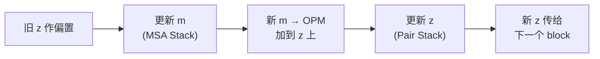
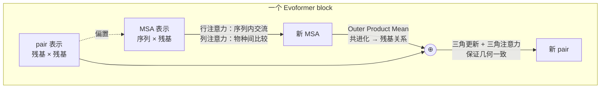
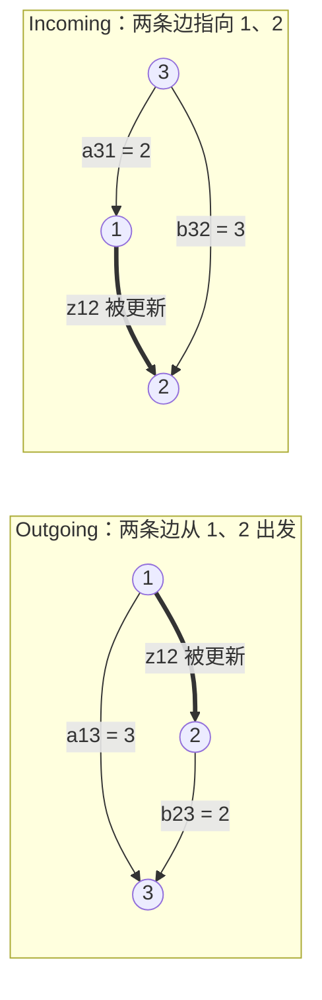
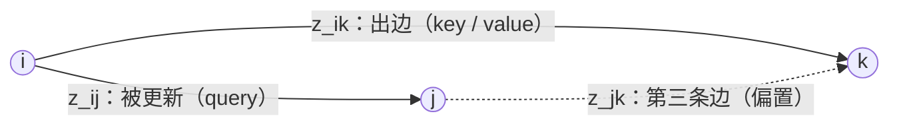
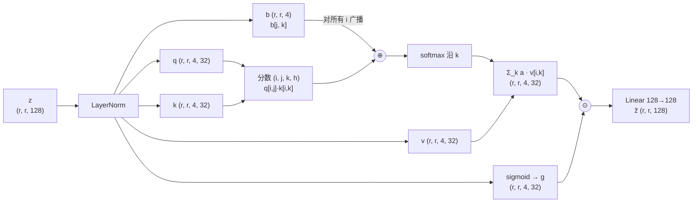
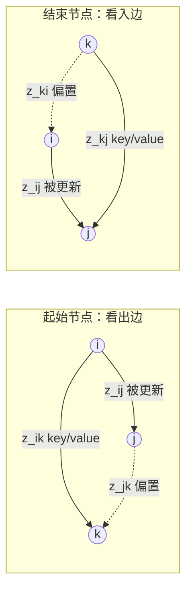
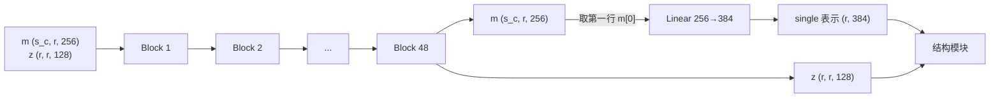

---
tags:
  - 生物
  - AlphaFold
---

> [!note] 本节要点
> - Evoformer 由 48 个输入输出形状不变的 block 堆成，MSA 表示和 pair 表示双轨交替更新，约 8800 万参数是全模型的大头；
> - 两条信息通道贯穿每个 block：pair 表示作偏置注入行注意力，MSA 表示经 Outer Product Mean 把共进化信息写进 pair；
> - 三角更新与三角注意力用“第三条边”保证几何一致，实现时唯一要转置的是结束节点三角注意力的偏置。

**Evoformer**，它是 AlphaFold 最核心、参数最多的模块。[[Feature Extraction|上一课]]做出的 4 个特征张量，经过 Input Embedder 之后就进入这里。
## 1. 开场：Evoformer 有多重要
- **参数占比**：AlphaFold 共约 9300 万参数，Evoformer 占了约 **8800 万**
- **它已经“理解”了结构**：视频展示了 Evoformer 最后几层的注意力权重热图，形状和最终预测结构的**残基间距离图**非常像。也就是说，在进入结构模块之前，Evoformer 基本已经弄清了哪些残基彼此靠近
- **分工**：Evoformer 负责理解残基间的关系，后面的**结构模块**把这些信息转换成真正的原子坐标
- **结构**：由多个**相同的 block** 堆叠而成，核心机制是注意力，和 Transformer 类似，但设计更精巧

## 2. 概览：先跳过 Input Embedder
**先讲 Evoformer，下一课再讲 Input Embedder**。原因是 Input Embedder 里的 Extra MSA Stack 其实就是**缩小版的 Evoformer**，先学 Evoformer 再回头看会更容易。
![[Pasted image 20260925144534.png]]
`extra_msa_feat` 的线从左上角出发，**向下接到 pair 那一行的 `···`**，没有自己独立的表示方块。这正好体现了它的作用：**Extra MSA 这一路最终只影响 pair 表示。**
**现在只需要记住：Evoformer 的输入是两个张量**

|表示|形状|AlphaFold 中的通道数|
|---|---|---|
|**MSA 表示** `m`|`(s_c, r, c_m)`|c_m = 256|
|**Pair 表示** `z`|`(r, r, c_z)`|c_z = 128|

r 是残基数，s_c 是簇中心数量（512）。
## 3. Evoformer 概览
![[Pasted image 20260925145159.png]]

### 3.1. 整体框架：输入输出形状相同
白色圆角框就是一个 block：
- **左边输入**：MSA 表示 `(s_c, r, c_m)` 和 pair 表示 `(r, r, c_z)`
- **右边输出**：还是这两个表示，**形状完全不变**
这和 Transformer 的 block 一样：输入输出形状相同，所以可以直接串联，上一个 block 的输出就是下一个 block 的输入。
block 里分成**上下两行**：
- **上行（MSA Stack）**：更新 MSA 表示，3 个模块
- **下行（Pair Stack）**：更新 pair 表示，5 个模块
两行之间有**两条竖线**，也就是两条信息通道。
### 3.2. 为什么所有注意力都只做“行”或“列”？
看图里的模块名：row-wise、column-wise、around starting node、around ending node。**没有一个是对整个张量做完整注意力的。**
原因是张量太大。以 400 个残基为例：

|方式|注意力分数的数量|显存（float32）|
|---|---|---|
|pair 表示整体做注意力：160,000 个条目两两配对|$160{,}000^2$|**约 102 GB**|
|按行做注意力：每行 $400^2$，共 400 行|$400^3$|**约 256 MB**|

完整注意力根本放不进显存，所以 AlphaFold 把注意力拆成行和列。行注意力让同一行的元素互相交流，列注意力让同一列的元素互相交流，交替使用，信息最终也能传遍整个张量。
### 3.3. 上行：MSA Stack
MSA 表示的两个维度含义很明确：**行 = 物种（序列），列 = 残基位置**。

|模块|注意力方向|含义|
|---|---|---|
|**row-wise gated attention with pair bias**|同一行内，各位置之间|同一条序列中，残基 i 关注残基 j，并参考 pair 表示中 i–j 的关系|
|**column-wise gated attention**|同一列内，各序列之间|同一位置上，不同物种互相比较，对应**保守性**信息|
|**Transition**|无注意力|两层前馈网络，每个位置独立变换，中间维度扩大 4 倍|

名字里的 **gated** 指的是注意力输出会乘以一个 sigmoid 门控，这在[[AlphaFold 中的注意力详解（上篇）：单头 · 多头 · 全局 · 门控|注意力详解·上篇]]里讲过。
### 3.4. 两条信息通道：图里的两条竖线
这是这张图最值得仔细看的地方。
**通道 ①：pair → MSA（向上的箭头）**
从 pair 表示的输入线**向上**接到行注意力，作为**偏置**：
$$
a_{sij} = \text{softmax}_j\left(\frac{\mathbf{q}_{si}\cdot\mathbf{k}_{sj}}{\sqrt{c}} + b_{ij}\right), \quad b_{ij} = \text{Linear}(\text{LayerNorm}(\mathbf{z}_{ij}))
$$
效果：残基 i 该多关注残基 j，**不仅看序列内容，还要看 pair 表示认为 i 和 j 关系如何**。偏置 $b_{ij}$ 不带 s，所以**所有序列（行）共享同一个偏置**。
**通道 ②：MSA → pair（向下的箭头）**
MSA Stack 处理完之后，**向下**经过 **Outer Product Mean**，在 ⊕ 处**加到** pair 表示上：
$$
(s_c, r, c_m) \xrightarrow{\text{Outer Product Mean}} (r, r, c_z)
$$
效果：把 MSA 中位置 i 和位置 j 在所有序列上的**共进化**信息写入 pair 表示。
#### Outer Product Mean 怎么计算
对每一对残基位置 (i, j)，**先在每条序列上把位置 i 的向量和位置 j 的向量做外积，再对所有序列取平均**。
输入是 MSA 表示 $\mathbf{m}_{si}$，形状为 $(s, r, c_m{=}256)$。

| 步骤        | 计算                                                                                                        | 输出形状                          |
| --------- | --------------------------------------------------------------------------------------------------------- | ----------------------------- |
| ① 归一化     | $\mathbf{m}_{si} \leftarrow \text{LayerNorm}(\mathbf{m}_{si})$                                            | $(s, r, 256)$                 |
| ② 两个线性投影  | $\mathbf{a}_{si} = \text{Linear}_a(\mathbf{m}_{si})$，$\mathbf{b}_{si} = \text{Linear}_b(\mathbf{m}_{si})$ | 各为 $(s, r, 32)$               |
| ③ 先外积，再平均 | $\mathbf{o}_{ij} = \text{flatten}\Big(\dfrac{1}{S}\sum_s \mathbf{a}_{si}\otimes\mathbf{b}_{sj}\Big)$      | $(r, r, 32{\times}32{=}1024)$ |
| ④ 输出投影    | $\text{Linear}(\mathbf{o}_{ij})$                                                                          | $(r, r, c_z{=}128)$           |

最后执行 $\mathbf{z}_{ij} \leftarrow \mathbf{z}_{ij} + \text{Linear}(\mathbf{o}_{ij})$，这一步就是图里的 ⊕。

**⚠️ 注意两个“接入点”的位置**
仔细看图：
- **偏置的接入点在 block 最左边**：MSA 行注意力用的是**本 block 开始时的 pair 表示**，也就是还没被本 block 更新过的
- **Outer Product Mean 的接入点在 MSA Transition 之后**：pair 用的是**本 block 已经更新完的 MSA 表示**
所以一个 block 内部的执行顺序是：

**先更新 MSA，再更新 pair**，信息在两者之间交替流动。48 个 block 下来，MSA 和 pair 反复互相修正。
### 3.5. 下行：Pair Stack
pair 表示的两个维度都是残基：$z_{ij}$ 描述残基 i 和 j 的关系，可以理解为**从 i 指向 j 的有向边**。

|模块|操作方向|用到的边|补全三角形的边|
|---|---|---|---|
|**Triangle update using outgoing edges**|行|$z_{ik}$（从 i 出发）|$z_{jk}$|
|**Triangle update using incoming edges**|列|$z_{kj}$（指向 j）|$z_{ki}$|
|**Triangle attention around starting node**|行注意力|$z_{ik}$|偏置 $b_{jk}$|
|**Triangle attention around ending node**|列注意力|$z_{kj}$|偏置 $b_{ki}$（要转置）|
|**Transition**|无|—|—|

规律很整齐：
- **“outgoing / starting node” = 行操作**，第一个下标 i 固定
- **“incoming / ending node” = 列操作**，第二个下标 j 固定
- **乘法更新**和**注意力**各有一对行和列
两种三角模块的区别：

|          | 三角乘法更新           | 三角注意力                   |
| -------- | ---------------- | ----------------------- |
| 怎样汇总所有 k | 逐元素相乘，然后**等权求和** | 通过 softmax 权重**有选择地**加权 |
| 第三条边的作用  | 直接参与乘法           | 作为**偏置**，影响注意力分数        |
| 计算量      | 较小               | 较大                      |

### 3.6. 图里没画出的细节
**① 残差连接**
图里每个模块看起来是串联的，实际上**每个模块的输出都加回到输入上**：
```python
m = m + row_attention(m, z)
m = m + column_attention(m)
m = m + msa_transition(m)
z = z + outer_product_mean(m)      # 就是图里的 ⊕
z = z + triangle_mult_outgoing(z)
z = z + triangle_mult_incoming(z)
z = z + triangle_attention_start(z)
z = z + triangle_attention_end(z)
z = z + pair_transition(z)
```
图里只画出了 Outer Product Mean 的那个 ⊕，其他 8 个模块其实也都是“加”上去的。
**② Dropout**
训练时 AlphaFold 会按整行或整列做 dropout，推理时不用，所以图里也没画。
**③ 各模块的主要超参数**（来自 AlphaFold 论文）

|模块|头数 × 每头维度|其他|
|---|---|---|
|MSA 行注意力、列注意力|8 × 32|—|
|Outer Product Mean|—|a、b 各 32 维，外积后 32×32=1024 维|
|三角乘法更新|—|中间维度 128|
|三角注意力|4 × 32|—|
|Transition|—|扩大 4 倍|

### 3.7. 一句话理解这张图

## 4. MSA 门控注意力
![[Pasted image 20260925155450.png]]

|符号|含义|值|
|---|---|---|
|`s_c`|簇中心序列数|512|
|`r`|残基数|本例 59|
|`c_m`|MSA 表示的通道数|256|
|`c_z`|pair 表示的通道数|128|
|`h`|注意力头数|8|
|`c`|每个头的维度|32|

### 4.0. 输入是 MSA 表示的“一行”
图左上是完整的 MSA 表示 `(s_c, r, c_m)`，但真正送进注意力的是左边的 **`Input (r, c_m)`**，也就是**其中一行**：一条序列的全部 r 个残基。
- **行注意力**：一行内部的 r 个残基互相关注
- 512 行**各自独立**地做同样的计算，共享同一套权重。实现时把 `s_c` 当作 batch 维即可
进入注意力之前，先对输入做 **LayerNorm**。图里没有画出这一步。
### 4.1. 四个线性层
从 `Input` 出发，向上分出 **4 条线**，各经过一个 `Linear c_m → (h, c)`：

|从下往上|输出|形状|用途|
|---|---|---|---|
|第 1 条|**queries**|`(r, h, c)`|每个残基“想找什么”|
|第 2 条|**keys**|`(r, h, c)`|每个残基“能提供什么”的标签|
|第 3 条|**values**|`(r, h, c)`|每个残基实际传递的内容|
|第 4 条（最上面）|**gate**，后接 sigmoid|`(r, h, c)`|输出门控|

**记号 `c_m → (h, c)` 是什么意思？**
意思是：线性层从 256 维映射到 $h \times c = 8 \times 32 = 256$ 维，然后 **reshape** 成 `(h, c) = (8, 32)`：
```python
q = linear_q(x)          # (r, 256) → (r, 256)
q = q.view(r, 8, 32)     # → (r, h=8, c=32)
```
图里 queries、keys、values 都画成**叠起来的多层**，每一层就是一个头。8 个头各自独立计算注意力，最后再合并。
### 4.2. 点积亲和度 `dot-product affinities (r, r, h)`
每个 query 和每个 key 做点积，再除以 $\sqrt{c}$：
$$
\text{affinity}^h_{ij} = \frac{\mathbf{q}^h_i \cdot \mathbf{k}^h_j}{\sqrt{c}}
$$
- 第一个 `r`（下标 i）：**query**，即“谁在关注别人”
- 第二个 `r`（下标 j）：**key**，即“被关注的是谁”
- `h`：每个头一张 `r × r` 的矩阵
图里 queries 从左边横着射入，keys 从上方竖着射入，交汇成方阵，正好表示“每个 query 和每个 key 两两配对”。
**为什么要除以 $\sqrt{c}$？** 两个 32 维向量的点积，数值会随维度增大而变大。不缩放的话，softmax 很容易变得极端，几乎所有权重都集中到一个位置上，梯度也会变得很小。
### 4.3. pair 表示变成偏置
图下方的黄色部分是这个模块的特别之处：
**`pair 表示 (r, r, c_z=128)`** ──LayerNorm──**`Linear c_z → h`**──→ **`bias (r, r, h=8)`**
形状几乎是现成的：pair 表示本来就是 `(r, r, ·)`，**只需要把通道维 128 映射到头数 8**，就和亲和度矩阵 `(r, r, h)` 完全对齐了。
视频特别说明了一个容易误解的地方：图里 pair 表示画成一层，bias 画成多层，看起来 bias 多了一个维度。其实两者都是三维张量：
- pair 表示中**每个方块是一个 128 维向量**
- bias、亲和度、注意力权重中**每个方块只是一个数**，多层表示多个头
**偏置对所有行共享**：bias 只有 `(i, j)` 下标，没有序列下标 s，所以 512 行用的是同一个偏置。
### 4.4. 相加，再 softmax
图中的 ⊕ 把亲和度和偏置相加，再做 softmax：
$$
a^h_{ij} = \text{softmax}_j\left(\frac{\mathbf{q}^h_i \cdot \mathbf{k}^h_j}{\sqrt{c}} + b^h_{ij}\right)
$$
- **softmax 沿 j（key 维）归一化**：对每个 query i，它分配给所有 key 的权重加起来等于 1
- 得到 **attention weights `(r, r, h)`**
#### 偏置到底起什么作用？看一个数值例子
假设残基 i 对三个残基 j₁、j₂、j₃ 的亲和度分别是 `[2.0, 2.0, 0.5]`：

|             | j₁       | j₂       | j₃   |
| ----------- | -------- | -------- | ---- |
| 亲和度         | 2.0      | 2.0      | 0.5  |
| **不加偏置**的权重 | 0.45     | 0.45     | 0.10 |
| pair 偏置     | +1.0     | −1.0     | 0    |
| 相加后         | 3.0      | 1.0      | 0.5  |
| **加偏置**的权重  | **0.82** | **0.11** | 0.07 |

只看序列内容，j₁ 和 j₂ 一样重要。但 pair 表示“认为” i 和 j₁ 关系更密切（比如空间上更近），于是注意力明显偏向 j₁。
这就是 **pair → MSA 的信息通道**：MSA 分析序列时，会参考 pair 表示中积累的结构信息。
### 4.5. 加权求和 values → `out (r, h, c)`
用注意力权重对 values 加权求和：
$$
\mathbf{o}^h_i = \sum_j a^h_{ij}\,\mathbf{v}^h_j
$$
图里 values 从上方竖着落入注意力权重矩阵，再从右边横着输出到 `out`。每个残基 i 得到一个新向量，它是**所有残基 value 的加权平均**，权重就是 i 对它们的关注程度。
### 4.6. 门控 ⊙

最上面那条 `Linear → sigmoid` 的线一直延伸到右边的 **⊙**（逐元素相乘）：
$$
\tilde{\mathbf{o}}^h_i = \text{sigmoid}(\mathbf{g}^h_i) \odot \mathbf{o}^h_i
$$
- sigmoid 把 gate 压到 **0～1** 之间
- 它**逐通道**控制注意力输出能通过多少：接近 1 时保留，接近 0 时关闭
这就是名字里 **“gated”（门控）** 的含义。标准 Transformer 的注意力没有这一步。门控让模型可以根据残基自身的内容，决定“这次从别的残基收集来的信息要用多少”。
### 4.7. 输出线性层 → `output (r, c_m)`
把 8 个头拼接起来，$8 \times 32 = 256$ 维，再经过 `Linear (h, c) → c_m`，回到输入的形状 `(r, c_m)`。
之后通过**残差连接**加回到输入的 MSA 表示上（图中没有画出）。

## 5. MSA Stack
![[Pasted image 20260926094853.png]]
### 5.1. MSA 行注意力（带 pair 偏置）
![[Pasted image 20260925163233.png]]
**怎么看出是“行”注意力？**
- 行索引 **s 始终不变**，query、key、value、gate 都带着同一个 s
- 列索引才是注意力发生的地方：query 用 **i**，key 用 **j**，两两配对，softmax 也沿 **j** 归一化
**记号**：只有 $b$ 不是粗体，因为偏置的每个元素是**一个数**，其他符号都是向量。
**偏置的含义**：残基 i 在关注残基 j 时，会参考 pair 表示中 i 和 j 的关系。这是 **pair → MSA** 的信息通道。
**两个技术细节：**
- **移动偏置的维度**：我们的注意力实现中，头维是**倒数第三维**，不是最后一维，所以要把 `(r, r, h)` 变成 `(h, r, r)`
- **行注意力要指定列维为注意力维度**：听起来反直觉，但注意力是在一行**内部**的各列之间进行的，被遍历的是列索引。就像对矩阵的每一行求和时，求和发生在列维上
### 5.2. MSA 列注意力
![[Pasted image 20260925163524.png]]
和行注意力几乎一样，而且**不需要偏置**：
- 列索引 **i 保持不变**
- query 和 key 的配对发生在**行维**上，分别用 s 和 t 表示
含义：在**同一个残基位置**上，让不同物种的序列互相交流。这正对应[[Feature Extraction|上一课]]讲的“保守性”分析。
### 5.3. MSA Transition
![[Pasted image 20260925163648.png]]
标准的 Transformer 前馈块：
$$
\text{LayerNorm} \rightarrow \text{Linear}(c_m \to 4c_m) \rightarrow \text{ReLU} \rightarrow \text{Linear}(4c_m \to c_m)
$$
先扩大到 **4 倍**维度，再压回来。系数 4 也是 Transformer 中的常见取值。
## 6. Outer Product Mean：MSA → Pair
![[Pasted image 20260926091432.png]]
这就是**共进化**分析的可学习版本。如果位置 i 和 j 在各个物种中总是一起变化，$\mathbf{a}_{si} \otimes \mathbf{b}_{sj}$ 在所有序列上的平均就会体现出这种相关性。
用 einsum 实现：
```python
a = self.linear_a(m)                                  # (s, r, c)
b = self.linear_b(m)                                  # (s, r, c)
o = torch.einsum('sic,sjd->ijcd', a, b)               # 沿 s 求和 → (r, r, c, c)
o = o.flatten(-2)                                     # (r, r, c*c)
z = self.linear_out(o) / N_seq                        # 先线性层，再除以序列数

```
在 einsum 中，行维 s **被求和掉**，列维 i、j 和通道维 c、d 通过广播展开，得到目标形状。
## 7. 三角机制：为什么叫三角
Pair Stack 里大部分模块的名字都以 “Triangle” 开头。要理解这一点，先想想两种表示分别在编码什么。
 **MSA 表示的含义很直观**
- 一维是物种，另一维是残基位置，每个向量代表**某个物种的某个残基**
- **行操作**：同一物种内，不同位置互相交流
- **列操作**：同一位置上，不同物种互相交流
**Pair 表示：有向边**
pair 表示中每对残基有**两个条目**：$z_{ij}$ 和 $z_{ji}$。可以把它理解成一个**有向图**：
- $z_{ij}$：从 i 到 j 的信息
- $z_{ji}$：从 j 到 i 的信息
视频举了个例子：谷氨酸（带负电）告诉附近的甘氨酸“我带负电”，甘氨酸回复“我是中性的，不在乎”。
当然这只是理论上的解释。实际的值是学出来的特征，语义往往是混杂的（polysemantic）。但 AlphaFold 非常成功，所以值得认真理解它的设计思路。

## 8. Pair Stack
![[Pasted image 20260926094928.png]]
对照三角机制来看 Pair Stack 的 5 个模块：

|顺序|模块|边的方向|操作|
|---|---|---|---|
|1|三角乘法更新（outgoing）|出边|行|
|2|三角乘法更新（incoming）|入边|列|
|3|三角注意力（起始节点）|出边|行|
|4|三角注意力（结束节点）|入边|列|
|5|Pair Transition|—|前馈|

第 1、3 个用出边，是行操作；第 2、4 个用入边，是列操作。
### 8.1. 三角乘法更新
![[Pasted image 20260926105032.png]]
#### 设定（简化版）
- 3 个残基，编号 1、2、3
- 只看 1 个通道，所以 a、b 都是 3×3 的数字矩阵。真实模型里每个通道各算一遍
- 省略 LayerNorm、门控和线性层，只保留核心的“乘积再求和”
- $a_{ik}$ 表示**边 i→k** 上的值：**行号 = 起点，列号 = 终点**

```
        A                        B
      k=1 k=2 k=3              k=1 k=2 k=3
 1 [  1   2   3  ]        1 [  2   0   1  ]
 2 [  0   1   1  ]        2 [  1   1   2  ]
 3 [  2   1   0  ]        3 [  0   3   1  ]
```

**目标：计算 $\tilde z_{12}$，也就是边 1→2 的更新量。**
#### Outgoing：$\sum_k a_{1k} \cdot b_{2k}$，取 A 的第 1 行和 B 的第 2 行
$$
\begin{aligned} &\mathbf{z}_{ij} \leftarrow \text{LayerNorm}(\mathbf{z}_{ij}) \\ &\mathbf{a}_{ij} = \text{sigmoid}(\text{Linear}(\mathbf{z}_{ij})) \odot \text{Linear}(\mathbf{z}_{ij}) \\ &\mathbf{b}_{ij} = \text{sigmoid}(\text{Linear}(\mathbf{z}_{ij})) \odot \text{Linear}(\mathbf{z}_{ij}) \\ &\mathbf{g}_{ij} = \text{sigmoid}(\text{Linear}(\mathbf{z}_{ij})) \\ &\tilde{\mathbf{z}}_{ij} = \mathbf{g}_{ij} \odot \text{Linear}\left(\text{LayerNorm}\left(\sum_k \mathbf{a}_{ik} \odot \mathbf{b}_{jk}\right)\right) \end{aligned}
$$
- 先构造两个嵌入 a 和 b，形式都是**线性嵌入 × 类似门控的 sigmoid 嵌入**
- 再构造一个输出门 g
- **关键在第 4 行**：用 $\mathbf{a}_{ik}$（出边 i→k）和 $\mathbf{b}_{jk}$（第三条边 j→k）**逐元素相乘，再对 k 求和**。这正是三角理论的体现
- 求和之后依次做 LayerNorm、线性层、乘以门控
```
A 第 1 行:   a11  a12  a13  =  1   2   3
B 第 2 行:   b21  b22  b23  =  1   1   2
逐项相乘:                      1   2   6   → 求和 = 9
```

|k|这一项|用到的两条边|
|---|---|---|
|1|1 × 1 = 1|1→1、2→1|
|2|2 × 1 = 2|1→2、2→2|
|3|3 × 2 = 6|**1→3、2→3** ← 真正的三角形|

看 k=3 这一项：1 和 2 **各自发出**一条边指向 3，所以叫 **outgoing**。
#### Incoming 版本（Algorithm 12）只改了一处
$$
\sum_k \mathbf{a}_{ki} \odot \mathbf{b}_{kj}
$$
用入边 $k \to j$ 和第三条边 $k \to i$。
```
A 第 1 列:   a11  a21  a31  =  1   0   2
B 第 2 列:   b12  b22  b32  =  0   1   3
逐项相乘:                      0   0   6   → 求和 = 6
```

|k|这一项|用到的两条边|
|---|---|---|
|1|1 × 0 = 0|1→1、1→2|
|2|0 × 1 = 0|2→1、2→2|
|3|2 × 3 = 6|**3→1、3→2** ← 真正的三角形|

看 k=3 这一项：3 **分别指向** 1 和 2，也就是 1 和 2 各**收到**一条边，所以叫 **incoming**。
#### 两者对比

#### 整体来看：其实就是矩阵乘法

对所有 (i, j) 都这样算，结果正好是两种矩阵乘法：

|        | Outgoing                          | Incoming                          |
| ------ | --------------------------------- | --------------------------------- |
| 公式     | $\tilde Z = A B^\top$             | $\tilde Z = A^\top B$             |
| 取法     | A 的**行** · B 的**行**               | A 的**列** · B 的**列**               |
| 本例结果   | `[[5, 9, 9], [1, 3, 4], [4, 3, 3]]` | `[[2, 6, 3], [5, 4, 5], [7, 1, 5]]` |
| einsum | 'ikc,jkc->ijc'                    | 'kic,kjc->ijc'                    |

两个结果矩阵第 1 行第 2 列的值，分别就是上面算出的 **9** 和 **6**。
有多个通道时，einsum 里的 `c` 表示每个通道各自独立做一次这样的矩阵乘法。
**一句话记住：** Outgoing 看 i 和 j 这两**行**，也就是“我们都指向谁”；Incoming 看 i 和 j 这两**列**，也就是“谁同时指向我们”。
### 8.2. 三角注意力
#### 8.2.1. 围绕起始节点
![[Pasted image 20260926105905.png]]
##### 8.2.1.1. 先看右边的小图：三角形在哪里
小图是 pair 表示 `z` 的俯视图，**行号是第一个下标，列号是第二个下标**：

| 格子     | 颜色   | 角色                          | 对应公式                               |
| ------ | ---- | --------------------------- | ---------------------------------- |
| **ij** | 橙色   | 要更新的条目，提供 **query**         | $\mathbf{q}_{ij}$                  |
| **ik** | 箭头经过 | 同一行的其他条目，提供 **key 和 value** | $\mathbf{k}_{ik}, \mathbf{v}_{ik}$ |
| **jk** | 标注   | 第三条边，提供**偏置**               | $b_{jk}$                           |

箭头**沿第 i 行横向移动**，k 从头扫到尾，所以这是**行注意力**。
用有向图来理解：

- 更新边 **i→j** 时，参考所有从 i 出发的边 **i→k**，这就是“围绕起始节点 i”
- 对每个 k，用 **j→k** 这条边决定 i→k 值得关注多少
- i、j、k 构成一个三角形
**直观理解**：如果 pair 表示编码的是距离，要推断 i 和 j 的距离，可以参考“i 到 k 的距离”。但参考哪些 k 更可靠，要看“j 到 k 的距离”。三条边必须满足三角不等式，这样才能拼出真实的三维结构。
##### 8.2.1.2. 逐行解读算法
参数：c = 32（每个头的维度），N_head = 4（头数）。
**输入投影（第 1～4 行）**

|行|内容|形状（r = 59, c_z = 128）|
|---|---|---|
|1|对 z 做 LayerNorm|`(r, r, 128)`|
|2|线性层得到 q、k、v，**无偏置项**|各 `(r, r, 4, 32)`|
|3|线性层得到偏置 b，把通道 128 映射到头数 4，**无偏置项**|`(r, r, 4)`|
|4|线性层 + sigmoid 得到门控 g，**有偏置项**|`(r, r, 4, 32)`|

注意：q、k、v、b、g **全部来自同一个 z**。在 MSA 行注意力中，q、k、v、g 来自 m，偏置来自 z；这里 z 同时扮演这两个角色。
**第 5 行：注意力权重**
$$
a^h_{ijk} = \text{softmax}_k\left(\frac{1}{\sqrt{c}}\,\mathbf{q}^{h\top}_{ij}\,\mathbf{k}^h_{ik} + b^h_{jk}\right)
$$
逐个看下标：
- **i 在 q 和 k 中都出现，且保持不变**：注意力只在第 i 行内部进行
- **query 用 j，key 用 k**：同一行中的不同列两两配对
- **softmax 沿 k 归一化**：对每个 query ij，分配给所有 key ik 的权重之和为 1
- **偏置用 jk**：由 query 的列号 j 和 key 的列号 k 决定，**和 i 无关**
**第 6 行：加权求和并门控**

$$
\mathbf{o}^h_{ij} = \mathbf{g}^h_{ij} \odot \sum_k a^h_{ijk}\,\mathbf{v}^h_{ik}
$$

用权重对同一行的 value 加权求和，再乘以门控。

**输出投影（第 7 行）**
4 个头拼接起来，$4 \times 32 = 128$ 维，经过线性层映射回 $c_z = 128$。之后通过残差连接加回 z。
##### 8.2.1.3. 关键发现：和 MSA 行注意力是同一个模式
把两个算法并排比较：

|            | MSA 行注意力（Alg. 7）                        | 起始节点三角注意力（Alg. 13）                      |
| ---------- | --------------------------------------- | --------------------------------------- |
| 输入张量       | m `(s, r, c_m)`                         | z `(r, r, c_z)`                         |
| 固定不变的“行”下标 | s                                       | **i**                                   |
| 做注意力的下标    | i（query）、j（key）                         | **j**（query）、**k**（key）                 |
| 注意力分数      | $\mathbf{q}_{si} \cdot \mathbf{k}_{sj}$ | $\mathbf{q}_{ij} \cdot \mathbf{k}_{ik}$ |
| 偏置         | $b_{ij}$，来自 **z**                       | $b_{jk}$，来自 **z 自己**                    |
| 偏置是否和行下标有关 | 与 s 无关，所有行共享                            | 与 i 无关，所有行共享                            |
| 头数 × 维度    | 8 × 32                                  | 4 × 32                                  |

**把 z 的第一个下标 i 看成 MSA 中的序列下标 s，两个算法就完全一样了。**
这也是视频结尾说的 [23:50]：三角注意力听起来很巧妙，说到底只是“**用 pair 表示自己作偏置**”。
**所以偏置不需要转置**
对固定的第 i 行，注意力分数是一个 `(j, k)` 矩阵，也就是 `(query 列, key 列)`。偏置 $b_{jk}$ 的下标顺序也是 `(j, k)`，**顺序一致**，直接相加即可。
这和下一个模块“围绕结束节点”不同，那里的偏置是 $b_{ki}$，和注意力分数的顺序相反，所以必须转置。
##### 8.2.1.4. 形状变化流程图

#### 8.2.2. 围绕结束节点
![[Pasted image 20260926114242.png]]
这个模块和“围绕起始节点”的版本**几乎一样** [18:49]。图中黄色高亮的就是全部区别，一共只有 **3 处**：

|行|起始节点（Alg. 13）|结束节点（Alg. 14）|
|---|---|---|
|第 5 行 key|$\mathbf{k}_{ik}$|$\mathbf{k}_{\color{orange}kj}$|
|第 5 行偏置|$b_{jk}$|$b_{\color{orange}ki}$|
|第 6 行 value|$\mathbf{v}_{ik}$|$\mathbf{v}_{\color{orange}kj}$|

**区别 1：从“行”变成“列”**
看第 5、6 行的下标：
$$
a^h_{ijk} = \text{softmax}_k\left(\frac{1}{\sqrt{c}}\,\mathbf{q}^{h\top}_{ij}\,\mathbf{k}^h_{\color{orange}kj} + b^h_{\color{orange}ki}\right), \qquad \mathbf{o}^h_{ij} = \mathbf{g}^h_{ij} \odot \sum_k a^h_{ijk}\,\mathbf{v}^h_{\color{orange}kj}
$$
- **第二个下标 j 在 q、k、v 中都保持不变**，注意力只在**第 j 列**内部进行
- query 用行号 i，key 用行号 k，同一列中的不同行两两配对
```text
          列 i         列 j
           ↓            ↓
行 k →   · [ki] ·   · [kj]  ·        ← key/value 来自 kj，偏置来自 ki
         ·   ·   ·   ·   ↑   ·
行 i →   ·   ·   ·   · [ij]  ·        ← 要更新的条目（query）
         ·   ·   ·   ·   ↓   ·
                         沿第 j 列纵向扫描所有 k

```
 **区别 2：三角形换了方向**

- **起始节点**：更新 i→j 时，参考从 **i 出发**的所有边 i→k，用 j→k 作偏置
- **结束节点**：更新 i→j 时，参考**指向 j** 的所有边 k→j，用 k→i 作偏置
两个模块配合使用，每条边既能从起点那一侧、也能从终点那一侧收集信息，三角形的两种“朝向”都覆盖到了。
**区别 3：偏置要转置（最容易出错）⚠️**
这是实现时**唯一需要特别注意**的地方。
对某一个固定的列 j，注意力分数构成一个矩阵，下标顺序是：
$$
\text{scores}[\,i, k\,] \quad (\text{query 行号}, \text{key 行号})
$$
而偏置是 $b_{ki}$，下标顺序是 **(k, i)**，正好**反过来**：

|      | 注意力分数需要的顺序 | 偏置本身的顺序             | 是否需要转置   |
| ---- | ---------- | ------------------- | -------- |
| 起始节点 | (j, k)     | $b_{jk}$，即 `(j, k)` | ❌ 不需要    |
| 结束节点 | (i, k)     | $b_{ki}$，即 `(k, i)` | ✅ **需要** |


所以在 PyTorch 中，要先把偏置矩阵的两个残基维**转置**，再加到注意力分数上：
$$
\text{bias\_used}[i, k] = b[k, i] = b^\top[i, k]
$$
和起始节点一样，这个偏置与被固定的下标（这里是 j）无关，所有列共享同一个转置后的偏置。
### 8.3. Pair Transition
和 MSA Transition 一样，是两层前馈网络。
![[Pasted image 20260926120827.png]]
## 9. 完整的 Evoformer
![[Pasted image 20260926120905.png]]
**其他实现细节**
**① 48 个 block** ：48 个相同结构的 block，**各自有独立的权重**。
**② Dropout 可以忽略** ：
- Dropout 是训练时用的正则化方法，随机把一些值置 0，并放大其他值，使期望保持不变
- AlphaFold 使用的是**按整行或整列置 0** 的 dropout
- 我们不训练，推理时不使用 dropout，所以不用实现
**③ 残差连接** ：
- 每个模块的输出**不是替换**输入，而是**加到**输入上
- 残差连接让训练稳定得多
- 以三角乘法更新为例：两行相乘再求和，是一个变化很剧烈的操作。有了残差连接，模型只需要学到较小的权重，输出接近 0，相当于在输入上做**小幅修正**，而不是完全替换
**④ Single 表示** ：
- Evoformer 最后取出 MSA 表示的**第一行**，经过一个线性层，得到 **single 表示**（`(r, c_s)`，AlphaFold 中 c_s = 384）
- **这是 MSA 表示中唯一传给结构模块的部分**，其余行全部丢弃
- 类似于第 3 课情感分析 notebook 中只用第一个 token 的输出做分类，模型要学会把信息汇总到这一行
- **为什么是第一行？** 回想[[Feature Extraction|上一课]]：`msa_feat` 的第一行来自**目标序列**（它永远是第一个簇中心），所以保留这一行是合理的。


相关笔记：[[Feature Extraction|上一节：Feature Extraction]]　·　[[AlphaFold 中的注意力详解（上篇）：单头 · 多头 · 全局 · 门控|注意力详解·上篇]]　·　[[AlphaFold 中的注意力详解（下篇）|注意力详解·下篇]]　·　[[AlphaFold-Decode 课程总览|alphafold-decoded 课程总览]]
