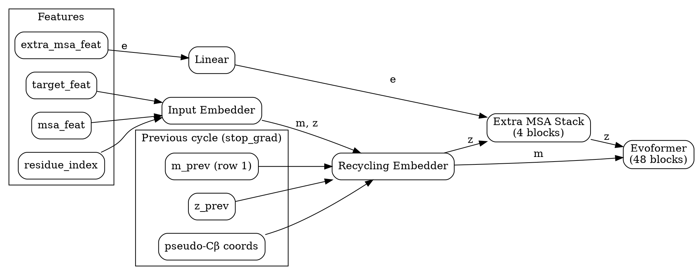
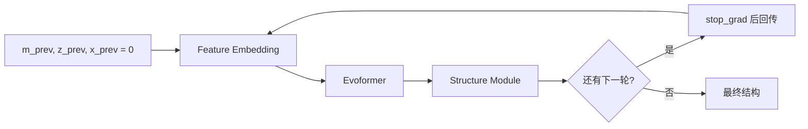
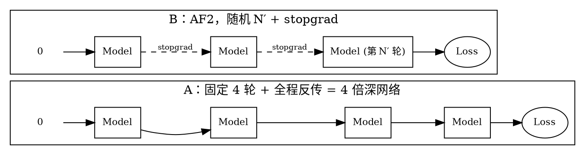
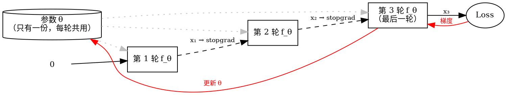
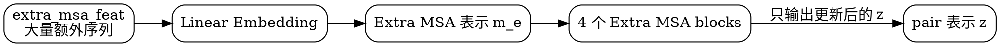
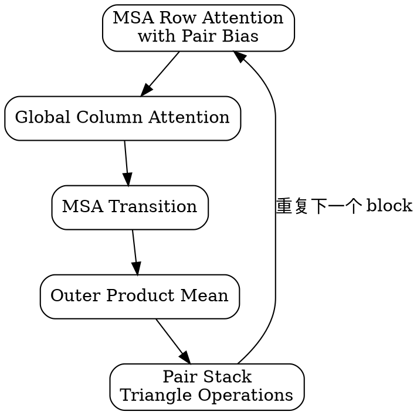
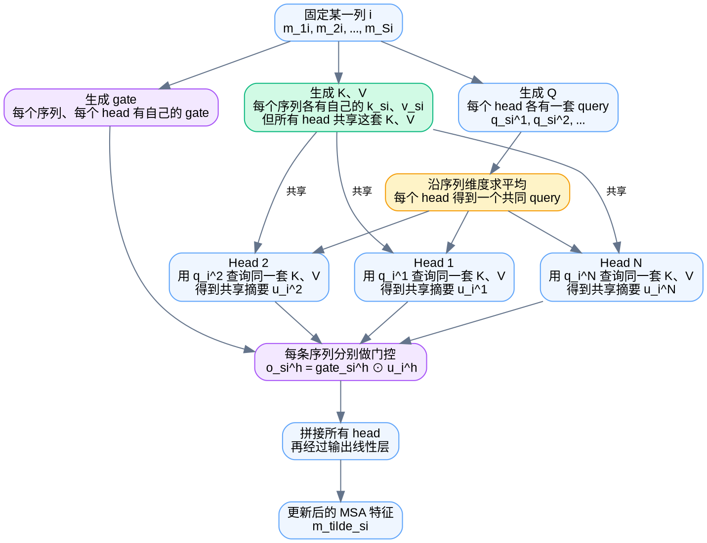

---
tags:
  - 生物
  - AlphaFold
---

> [!note] 本节要点
> - Input Embedder 把 target/msa 特征用外和与 relpos 位置编码拼成初始的 MSA 表示 m 和 pair 表示 z；
> - Recycling Embedder 把上一轮预测喂回模型：训练时轮数随机、轮间 stopgrad，保证每一轮的输出都是能交卷的结构；
> - Extra MSA Stack 是 4 个缩小版 Evoformer block，用额外序列只把修正写进 pair 表示，列注意力用省显存的 Global 版本。

![[Pasted image 20260927221718.png]]
上一集做了[[Feature Extraction|特征提取]]，得到 4 个张量：`target_feat`、`msa_feat`、`extra_msa_feat` 和 `residue_index`（就是 $0 \dots r-1$ 的序号）。再上一集实现了 [[Evoformer]]。这一课把两者接起来，中间有三个模块：
1. **Input Embedder**：把特征变成初始的 MSA 表示 $m$ 和 pair 表示 $z$，同时加入位置编码。attention 本身不知道顺序，所以需要位置编码。
2. **Recycling Embedder**：把上一轮预测的结果送回模型，让预测一轮比一轮好。
3. **Extra MSA Stack**：用没被选为聚类中心的那些“extra”序列来更新 pair 表示。
在模型里的实际执行顺序如下：

## 1. Input Embedder
结构很简单，伪代码几乎可以一行对一行地翻成代码。
**Pair 表示 $z$：** `target_feat` 分别经过两个线性层，得到 $a_i$ 和 $b_j$，再做外和（outer sum），形状就变成 $(r, r, c_z)$：
$$
z_{ij} = a_i + b_j + \text{relpos}(i, j)
$$
**MSA 表示 $m$：** `msa_feat` 和 `target_feat` 各过一个线性层后相加。`target_feat` 只有残基维度 $i$，要沿序列维度 $s$ 广播，流程图里写作 _tile_：
$$
m_{si} = \text{Linear}(f^{\text{msa}}_{si}) + \text{Linear}(f^{\text{target}}_{i})
$$
**相对位置编码 relpos** 
![[Pasted image 20260927222320.png]]
1. 先算残基序号两两之差：$d_{ij} = r_i - r_j$，得到一个反对称矩阵。
2. 再对 $d_{ij}$ 做 one-hot，然后过线性层映射到 $c_z$ 维。
论文里的 `one_hot` 是一个通用算法：找离 $x$ 最近的 bin，把那一位设为 1。作者指出这里用不着这么复杂，因为 $d_{ij}$ 本来就是整数，可以直接当类别索引：
```python
d = residue_index[:, None] - residue_index[None, :]
d = torch.clamp(d, -32, 32) + 32          # 平移到 [0, 64]
rel = F.one_hot(d, num_classes=65).float()
```
> 注意：超过 $\pm 32$ 的差值在原算法里会落到两端的 bin，所以代码里要先 `clamp`，再 $+32$。

## 2. Recycling Embedder
**什么是 recycling**
推理时，整个 AlphaFold 会对同一个蛋白**连续跑好几轮**，每一轮的输出作为下一轮的输入。第一轮没有上一轮的结果，就用全 0。

![[Pasted image 20260928095434.png]]
### 2.1. recycling inference 和 training inference

| 维度       | 推理（Alg 30）                                              | 训练（Alg 31）                                                        |
| -------- | ------------------------------------------------------- | ----------------------------------------------------------------- |
| 循环次数     | 固定 $N_{\text{cycle}}$（AF2 取 4，也就是 1 次正常前向加 3 次 recycle） | $N' \sim \mathcal{U}\{1,\dots,N_{\text{cycle}}\}$，整个 batch 共用同一个值 |
| 轮间梯度     | 推理不求梯度，不涉及                                              | $\text{stopgrad}(\text{outputs})$，每轮之间截断梯度                        |
| 使用哪一轮的输出 | 返回最后一轮                                                  | 只对第 $N'$ 轮算 loss                                                  |
| 前向次数     | $N_{\text{cycle}}=4$                                    | 期望 $\mathbb{E}[N'] = \frac{N_{\text{cycle}}+1}{2} = 2.5$          |
| 反向次数     | 0                                                       | 1（只经过最后一轮）                                                        |
| 需要保存的激活  | 无                                                       | 只有最后一轮的                                                           |

**recycling 是什么**
就像你写作文会打草稿：先写一版，再对着草稿改一版，再改一版。模型也一样，把自己上一轮的预测结果重新喂回去，让它在旧答案的基础上继续修改。每一轮用的都是==同一个模型（权重共享）==。

**推理**：老老实实改满 4 遍
- 草稿一开始是空白：$\text{outputs} = \mathbf{0}$
- 固定改 $N_{\text{cycle}}$ 遍（AF2 里是 4 遍）
- 交出最后一遍的结果
**训练**：
- 改几遍是随机的
- 每轮之间切断梯度（stopgrad），只对最后一轮算 loss
**训练时，模型只学一件事：拿到任何一版草稿，都能把它改得更好。推理时，就让它连续改 4 遍。**

#### 2.1.1. 问题 1：为什么不固定 N 个 Block？
如果全程反传，训练和推理都固定就等于 N 个 Block
没错。固定跑 4 轮、让梯度穿过每一轮，把它展开来看，就是一个 **4 倍深、权重共享的网络**，和 ALBERT、Universal Transformer 是同一个思路。这种网络是能训的。

1. **原因 1：训练太贵**
	AF2 跑一轮就包括 48 个 Evoformer block 和 8 层 Structure Module。只跑一轮已经得靠 gradient checkpointing 才塞得进显存。
	- **方案 A**：前向 4 轮，反向也 4 轮，中间激活都要为反传保留，显存和计算都大约翻 4 倍。
	- **方案 B**：前向平均只跑 $\mathbb{E}[N'] = \frac{1+2+3+4}{4} = 2.5$ 轮，反向只跑 1 轮。前面几轮只做前向，不存激活。
	粗略估一下：设前向一轮的代价为 $F$，反向约为 $2F$。
	$$
	\text{A: } 4F + 4 \times 2F = 12F \qquad \text{B: } 2.5F + 1 \times 2F = 4.5F
	$$
	B 大约便宜 2.7 倍，而且显存峰值只相当于一轮。
2. **这是最关键的一点，深度会被焊死**
	方案 A 只对第 4 轮打分，所以第 1 到 3 轮的中间结果**不需要是像样的结构**。模型完全可以学出一条只在第 4 步收尾的“专属轨迹”：比如第 2 步输出一种只有模型自己看得懂的中间态。这样一来：
	- 推理时少改几遍，比如简单的蛋白 2 轮就够，交出去的是半成品；
	- 推理时多改几遍，比如难的目标想跑 10 轮，第 5 轮以后的输入模型从没见过，结果可能反而变差。
	方案 B 里，任何一轮都可能是最后一轮，所以**每一轮的输出都必须是一个能交卷的结构**。这样模型学到的不是一个固定 4 步的流程，而是一个通用的“改进算子”：给它任何一版草稿，它都能改得更好一点。
	这个特性后来派上了大用场：ColabFold 和 AlphaFold-Multimer 都支持把循环数加到 20 轮左右，收敛了就提前停。难的目标会因此变好，简单的目标能省时间。换成方案 A 的“4 个 Block”，就做不到这一点。
#### 2.1.2. 问题 2：stopgrad 是冻结参数吗，把前几个 block 的参数冻结？
理解有一处偏差：**这几轮用的是同一套参数，并不存在“前几轮自己的参数”。** 所以 stopgrad 冻结的不是参数，它切断的是**轮与轮之间传递的那份数据**。
- **冻结参数**（freeze）：针对的是参数 $\theta$，效果是这些参数不再更新。
- **stopgrad**：针对的是某个中间张量，也就是计算图里的一条边。效果是反向传播时，梯度走到这条边就停下，不再传回上游。
##### stopgrad 的数学定义
$$
\text{前向：}\ \operatorname{sg}(x) = x \qquad\qquad \text{反向：}\ \frac{\partial\, \operatorname{sg}(x)}{\partial x} = 0
$$
前向计算时它什么也不做，值原样通过。反向传播时，它把这里的梯度当成 0。在 JAX 里对应 `jax.lax.stop_gradient(x)`，在 PyTorch 里对应 `x.detach()`。

## 3. Extra MSA Stack
![[Pasted image 20260928121334.png]]
Extra MSA Stack 的作用可以概括为：
> **利用大量额外的 MSA 序列，进一步修正残基两两之间的 pair 表示。**

它位于 Input Embedder 之后、Evoformer 之前：

这里的 `extra_msa_feat` 是[[Feature Extraction|特征提取]]阶段得到的额外序列。它们没有被选作 MSA 聚类中心，因此没有进入主 MSA 表示，但仍然包含很多进化信息。
### 3.1. 为什么还要单独处理 Extra MSA？
AlphaFold 的 MSA 通常包含大量序列。其中一部分序列会被挑选成聚类中心，进入主 Evoformer；剩下的大量序列就是 **Extra MSA**。如果把所有序列都直接放进主 Evoformer，计算量和显存开销会很大。因此 AlphaFold 采用了分工：
- 主 MSA：较精细地处理，最后同时更新 MSA 表示和 pair 表示。
- Extra MSA：用一个更轻量的网络处理，主要帮助更新 pair 表示。
所以 Extra MSA Stack 最终只保留对 $z_{ij}$ 的改进，不把额外的 MSA 表示继续传给后面的结构模块。
### 3.2. 一个 block 里面做什么？
Extra MSA Stack 基本上是一个缩小版的 [[Evoformer]]：


一个 block 的逻辑可以理解为：
1. **MSA 行注意力**  
    让同一条序列中的不同残基互相交流，同时使用 pair 表示作为 bias。
2. **Global MSA 列注意力**  
    让不同序列在同一个残基位置上交流，但使用节省显存的 global attention。
3. **MSA Transition**  
    对每个 MSA 特征做一个两层前馈网络。
4. **Outer Product Mean**  
    把 MSA 中学到的信息汇总成残基对之间的信息，更新 pair 表示。
5. **Pair Stack**  
    通过三角形乘法和三角形注意力，进一步整理 pair 表示中的几何关系。
AlphaFold 中 Extra MSA Stack 使用 **4 个 block**，而主 Evoformer 使用 **48 个 block**，因此它明显更轻量。
### 3.3. 它和 Evoformer 有哪些区别？

| 项目       | 主 Evoformer         | Extra MSA Stack         |
| -------- | ------------------- | ----------------------- |
| 处理的序列    | 聚类后的 MSA            | 额外的 MSA 序列              |
| block 数量 | 48                  | 4                       |
| MSA 通道规模 | 较大                  | 较小                      |
| 行注意力     | 普通配置                | 较小的 embedding dimension |
| 列注意力     | 普通 column attention | global column attention |
| 最终输出     | MSA 表示和 pair 表示     | 主要是 pair 表示             |

因此可以把它记成：
> **Extra MSA Stack = 用大量便宜的序列信息，提前把 pair 表示修得更准确。**

### 3.4. Global Column Attention
![[Pasted image 20260928123413.png]]
**同一列里的所有序列，先合出一个共同的 query，用它汇总这一列的信息，再由每条序列自己的 gate 决定接收多少**。


#### 按图逐步解释

##### 1. 输入是一列，而不是一行

固定某个残基位置 $i$，这一列包含 $S$ 条序列：

$$
m_{1i},m_{2i},\ldots,m_{Si}
$$

Column Attention 的任务，就是让这些序列在同一个位置上交换信息。

##### 2. 生成 Q、K、V

图中最容易混淆的地方是这里：

- Query 带有 head 下标：

$$
q_{si}^{h}
$$

- Key 和 value **没有** head 下标：

$$
k_{si},\qquad v_{si}
$$

这表示：

- 每条序列都有自己的 $k_{si}$、$v_{si}$；
- 但所有注意力 head 共用这些 $k_{si}$、$v_{si}$；
- 不同 head 只有自己的 query。

因此，Head 1 和 Head 2 使用的是同一套 K/V，但使用不同的 Q。

##### 3. 每个 head 把自己的 Q 平均掉

对第 $h$ 个 head：

$$
q_i^h=\frac{1}{S}\sum_{s=1}^{S}q_{si}^h
$$

原本这一列有 $S$ 个 query，现在每个 head 只留下一个共同 query。

所以：

- Head 1 得到 $q_i^1$；
- Head 2 得到 $q_i^2$；
- 这些 query 彼此不同；
- 但它们都会查询同一套 K/V。

##### 4. 每个 head 用共同 query 计算注意力

第 $h$ 个 head 的注意力权重为：

$$
a_{ti}^h= \operatorname{softmax}_t \left( \frac{(q_i^h)^\top k_{ti}}{\sqrt{c}} \right)
$$

虽然 K/V 是共享的，但不同 head 的 $q_i^h$ 不同，所以注意力权重 $a_{ti}^h$ 仍然不同。

然后得到该列的一份共享摘要：

$$
u_i^h=\sum_t a_{ti}^h v_{ti}
$$

注意，$u_i^h$ 没有序列下标 $s$。对于同一个 head，这是一份供整列使用的摘要。

##### 5. 用 gate 把序列差异加回来

如果所有序列都直接使用同一个 $u_i^h$，它们的输出就会完全相同。因此算法为每条序列生成自己的 gate：

$$
g_{si}^h=\operatorname{sigmoid}\bigl(\operatorname{Linear}(m_{si})\bigr)
$$

然后：

$$
o_{si}^h=g_{si}^h\odot u_i^h
$$

所以最终：

- 共享的是“这列应该从哪些序列提取信息”；
- 每条序列自己决定“接收这份摘要中的哪些通道”。

##### 6. 合并所有 head

最后把各个 head 的输出拼接起来，再经过线性层：

$$
\widetilde m_{si} = \operatorname{Linear} \left( \operatorname{concat}_h(o_{si}^h) \right)
$$

#### 和普通 Column Attention 的区别

普通 Column Attention 是：

- 每条序列都有自己的 query；
- 每条序列分别计算自己的注意力权重；
- 注意力矩阵大约是 $S\times S$。

Global Column Attention 是：

- 每个 head 先把 query 平均成一个；
- 所有序列共享这个 head 的注意力摘要；
- 再用各自的 gate 产生不同输出；
- 注意力权重数量从 $S^2$ 降到 $S$。

所以一句话记忆：

> **Global Column Attention 共享 K/V 和注意力摘要，但不共享 Q，也不共享最终的 gate。**

相关笔记：[[Evoformer|上一节：Evoformer]]　·　[[AlphaFold 中的注意力详解（上篇）：单头 · 多头 · 全局 · 门控|注意力详解·上篇]]　·　[[AlphaFold-Decode 课程总览|alphafold-decoded 课程总览]]