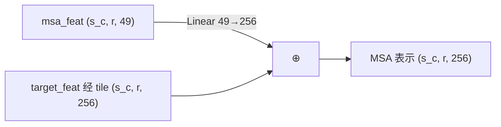
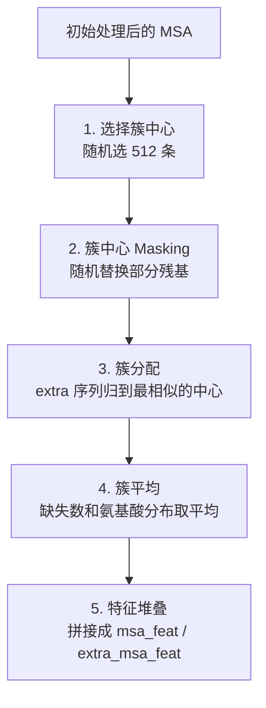
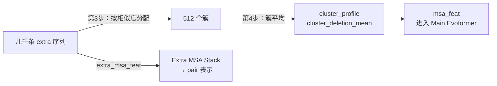
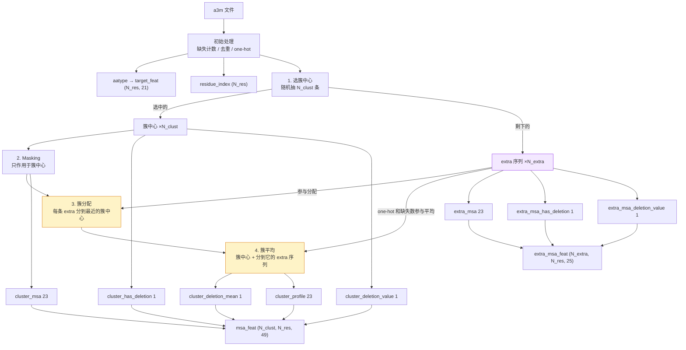

---
tags:
  - 生物
  - AlphaFold
---

> [!note] 本节要点
> - AlphaFold 的三路输入——目标序列、MSA、模板——各自编码成张量，注入 MSA 表示和 pair 表示；模板一路本系列跳过；
> - a3m 里的插入残基记作小写字母：先数每个位置左边的小写字母，再把它们删掉，让所有序列对齐到目标长度，one-hot 成 22 类；
> - 之后走五步主流程：选簇中心 → 簇中心 Masking → 簇分配 → 簇平均 → 特征堆叠，最终拼出 `msa_feat`（49 维）和 `extra_msa_feat`（25 维）。

## 1. 开场：这节课要解决什么
特征提取要回答两个问题：
1. **用什么数据？** 哪些生物学数据里真正包含蛋白质结构的信息？
2. **怎么转成张量？** 这些数据怎样编码成机器学习能用的形式？
## 2. AlphaFold 的三种输入
![[Pasted image 20260924124327.png]]
这张图画的是 AlphaFold 的 **Input Embedder**：各个输入特征怎样变成网络内部的表示，再送进 Evoformer。左边按颜色分成三组，正好对应三种输入：
- 🟨 **黄色**：目标序列（`target_feat`、`residue_index`）
- 🟪 **紫色**：MSA（`msa_feat`、`extra_msa_feat`）
- 🟩 **绿色**：模板（`template_angle_feat`、`template_pair_feat`）
### 2.0. 先看懂图里的符号

| 符号                              | 含义                   | AlphaFold 中的典型值        |
| ------------------------------- | -------------------- | ---------------------- |
| r                               | 残基数 N_res            | 蛋白长度                   |
| s_c                             | 簇中心序列数               | 512                    |
| s_e                             | extra MSA 序列数        | 1024（训练）/ 5120（推理）     |
| s_t                             | 模板数                  | 最多 4                   |
| `f`, `f_c`, `f_e`, `f_a`, `f_p` | 各输入特征的维度             | 21 / 49 / 25 / 57 / 88 |
| c_m                             | MSA 表示的通道数           | 256                    |
| c_z                             | pair 表示的通道数          | 128                    |
| c_e                             | extra MSA 表示的通道数     | 64                     |
| ⊕                               | 逐元素相加                |                        |
| **R**                           | Recycling：加入上一轮预测的结果 |                        |

**动物图标的意思：** 每个动物代表一个物种的序列。🐰 兔子是**目标蛋白**，所以 `target_feat` 旁边只有兔子，而 `msa_feat` 的第一行也是兔子（上节课讲过，目标序列永远是第一个簇中心）。其余动物代表同源序列。
中间有三种内部表示，后面整个网络都在更新它们：
- **MSA 表示** `(s_c, r, c_m)`：每条序列、每个位置一个向量
- **Pair 表示** `(r, r, c_z)`：每对残基一个向量，用来编码残基之间的关系，后面会变成距离和接触信息
- **Extra MSA 表示** `(s_e, r, c_e)`：大量额外序列，通道数更少，更省内存
### 2.1. 🟨 输入一：目标序列
目标序列只提供**两个张量**，但它会流向图里的**三条线**。
#### ① `target_feat (r, f)` → Pair 表示（外和）
图里 `target_feat` 分出两条 `Linear f → c_z`，再做 **outer sum（外和）**：
$$
a_i = \text{Linear}_1(\text{target\_feat}_i),\quad b_j = \text{Linear}_2(\text{target\_feat}_j)
$$

$$
z_{ij} = a_i + b_j
$$
直观理解：pair 表示里 (i, j) 这一格的初始值 = “残基 i 是什么氨基酸”的信息 + “残基 j 是什么氨基酸”的信息。两个线性层**不共享权重**，所以 $z_{ij} \neq z_{ji}$，模型可以区分方向。
#### ② `residue_index (r)` → relpos → Pair 表示
残基编号不直接输入网络，而是先转成**相对位置编码**：
$$
d_{ij} = \text{clip}(i - j,\ -32,\ 32) \quad \Rightarrow \quad \text{one-hot（65 类）} \Rightarrow \text{Linear} \to c_z
$$
然后加到 pair 表示上（图里的第一个 ⊕）：
$$
z_{ij} = a_i + b_j + \text{relpos}(i, j)
$$
**为什么用相对位置，而且截断在 ±32？** 对结构来说，“两个残基在序列上相隔多远”比绝对编号更重要。距离超过 32 之后，序列距离对局部结构的影响已经很小，统一归为“很远”就够了。
#### ③ `target_feat` → tile → MSA 表示
`target_feat` 还会经过 `Linear f → c_m`，再 **tile（复制）** `s_c` 份，变成 `(s_c, r, c_m)`，加到每一条 MSA 序列上。
**为什么要这样做？** MSA 里的每一行是另一个物种的序列。把目标序列的信息加到每一行，相当于告诉网络：“这一行在这个位置是 X，而目标蛋白在这个位置是 Y”。网络就能直接对比同源序列和目标序列的差异。
### 2.2. 🟪 输入二：MSA
#### ① `msa_feat (s_c, r, f_c)` → MSA 表示（主路径）

$$
m_{si} = \text{Linear}(\text{msa\_feat}_{si}) + \text{Linear}(\text{target\_feat}_i)
$$
这 512 条簇中心会进入 **Main Evoformer Stack**（48 个 block），在那里做完整的行注意力和列注意力，是模型最主要的信息来源。
#### ② `extra_msa_feat (s_e, r, f_e)` → Extra MSA 表示（辅助路径）
**`extra_msa_feat (s_e, r, 25)` ──Linear 25→64──→ `Extra MSA 表示 (s_e, r, 64)`**
它进入 **Extra MSA Stack**（4 个 block），这里和 pair 表示交互。
**关键点：看图右侧，Extra MSA Stack 只输出 pair 表示给 Main Evoformer。** Extra MSA 表示本身用完就丢掉了。它的作用是**把几千条额外序列里的共进化信息写进 pair 表示**。
**为什么要分成两条路径？**

|         | 主 MSA                | Extra MSA                           |
| ------- | -------------------- | ----------------------------------- |
| 序列数     | 512                  | 1024～5120                           |
| 每条序列的特征 | 49 维（含簇平均信息）         | 25 维                                |
| 通道数     | 256                  | 64                                  |
| 网络      | 48 个 Evoformer block | 4 个轻量 block（列注意力用 global attention） |
| 输出      | MSA 表示 + pair 表示     | 只有 pair 表示                          |

注意力的计算量随序列数增长很快。如果几千条序列都用 256 通道、跑 48 层，显存根本放不下。所以 AlphaFold 的做法是：
- 少量有代表性的序列（簇中心）做**精细处理**
- 大量额外序列做**粗略处理**，只把统计信息汇总到 pair 表示里
- 簇中心特征里的 `cluster_profile` 和 `cluster_deletion_mean` 也会把 extra 序列的平均信息带进主路径
### 2.3. 🟩 输入三：模板（本系列跳过）
模板是**已经解出三维结构的相似蛋白**。它有两个特征，分别注入 MSA 表示和 pair 表示。
#### ① `template_angle_feat (s_t, r, f_a)` → 作为额外的 MSA 行
每个模板、每个残基的**角度信息**（57 维），主要包括：
- 模板的氨基酸类型（one-hot）
- 骨架和侧链的扭转角（用 sin/cos 表示）
- 扭转角的 mask（哪些角度有效）
处理方式：`Linear → ReLU → Linear`，得到 `(s_t, r, c_m)`，再和 MSA 表示**在序列维度上拼接（concat）**：
$$
(s_c, r, c_m) \ \text{concat} \ (s_t, r, c_m) \Rightarrow (s_c + s_t,\ r,\ c_m)
$$
也就是说，**模板被当成额外的几条“序列”**，塞进 MSA 表示一起处理。区别是这几行带的是结构角度信息，不是氨基酸信息。
#### ② `template_pair_feat (s_t, r, r, f_p)` → 加到 Pair 表示
每个模板、每对残基的**几何信息**（88 维），主要包括：
- 残基间距离的分箱（distogram）
- 残基局部坐标系下的方向向量
- 两个残基的氨基酸类型
- 相关的 mask
它最后会**加到 pair 表示上**（图里第二个 ⊕，在 R 后面）。
> [!warning] 图里的标签可能是笔误
> 图里把这条线简化成了一个 `Linear f_e → c_e`。按 AlphaFold 原论文，完整流程是：先用 Linear 映射到模板通道 `c_t = 64`，经过 **Template Pair Stack**（几层三角更新和注意力）处理每个模板，再用 **Template Pointwise Attention** 把多个模板融合并映射到 `c_z`，最后才加到 pair 表示上。
#### 为什么本系列可以跳过模板？
- MSA 足够多样时，AlphaFold 对模板的依赖很小。共进化信息本身就包含了大量接触信息
- ColabFold 默认也不开模板
- 删掉后，图里整片绿色区域都不用实现，MSA 表示保持 `(s_c, r, c_m)`，不需要 concat
### 2.4. 图里的 **R**：Recycling
图里有两个 **R** 节点，分别在 pair 表示和 MSA 表示后面。上节课结尾提到过：AlphaFold 会把整个网络跑好几轮（默认 3 次 recycling，共 4 轮）。每一轮开始时，把上一轮的输出加回来：

|注入位置|加入的内容|
|---|---|
|Pair 表示|上一轮 pair 表示（LayerNorm 后）+ 上一轮预测结构中残基间距离的分箱编码|
|MSA 表示|只加到**第一行**（目标序列那行）：上一轮的第一行（LayerNorm 后）|

这样模型可以逐轮修正预测结果。每一轮的特征提取也会重新随机采样（簇中心和 masking 都不同），所以每轮看到的输入也略有差别。

## 3. 序列比对的背景知识
![[Pasted image 20260924135635.png]]
### 3.0. AlphaFold 为什么要找“相似序列”
图里的 MSA 输入来自多序列比对（Multiple Sequence Alignment）。它不是把许多蛋白质序列随便排成一张表，而是要尽量让**同一列代表不同蛋白质中彼此对应的位置**。
假设目标序列是：
```text
目标：  A C D E F G
同源：  A C X D E F G
```
同源序列中多了一个 `X`。如果直接从左往右按位置比较，`X` 后面的残基都会错位。比对算法会插入 gap，让对应位置重新对齐：
```text
目标：  A C - D E F G
同源：  A C X D E F G
```
这样，目标中的 `D` 仍和同源序列中的 `D` 对应。**比对的核心工作，就是推断哪些字符彼此对应，以及哪里可能发生过插入或缺失。**

### 3.1. 为什么序列能提供结构线索
蛋白质是氨基酸组成的长链。不同物种中的相似蛋白质通常来自共同祖先；比较它们的序列，可以观察哪些位置在进化过程中保留下来，哪些位置经常变化。
- **保守性**：如果一个位置在许多同源序列里都相同，说明这个位置可能受到功能或结构约束。它可能对维持蛋白质折叠、结合或催化很重要。
- **共同变化**：如果两个位置常常一起变化，一个位置发生替换时，另一个位置也跟着变化，它们可能存在功能或结构上的关联。例如，某处变大后，附近另一处变小，可能有助于维持整体形状。
不过，共同变化只是线索，不是“这两个残基一定接触”的证明。进化关系、共同祖先、功能变化等因素也会让位置一起变化。AlphaFold 的作用之一，就是结合大量这样的模式来推断结构。
### 3.2. 为什么不能直接按字符串位置比较
蛋白质序列在进化中可能发生三种变化：
1. **替换**：一个氨基酸换成另一个。
2. **插入**：某条序列中多出一个或多个氨基酸。
3. **缺失**：某条序列中少了一个或多个氨基酸。
替换通常不会改变后续位置的对应关系；插入或缺失则会让后面的字符整体错位。因此，比对时需要在序列之间插入特殊的 gap 字符 `-`。
比对算法不是只求“相同字符最多”。它会给不同情况打分，例如：
- 相同或性质相近的氨基酸，通常得分较高；
- 差异较大的替换，得分较低；
- 插入 gap 要扣分；
- 连续一段 gap 的代价通常不会简单地等于每个 gap 单独扣分之和。
这样可以避免算法为了多对上几个字符，就随意插入大量 gap。
### 3.3. 比对算法大致怎样工作
视频提到 Needleman–Wunsch 算法。它用**动态规划**逐步比较两个序列：对每一种可能的前缀组合，记录目前能得到的最佳分数，再从这些结果推出整条序列的最佳对齐。
最简单的全局比对会尝试覆盖两条序列的全长，适合长度相近、整体相似的序列。局部比对则寻找其中最相似的一段，适合两条序列只有部分区域相似的情况。真实的序列数据库搜索还会用更快的启发式方法、profile 或 HMM 等工具，因为逐一精确比对所有序列的成本太高。
**序列相似不等于序列完全相同。** 比对算法要容忍合理的替换、插入和缺失，才能找到真正有共同来源的序列。
### 3.4. a3m 文件里的大写字母、小写字母和 `-`
视频使用的输入是 a3m 格式。理解它时，要把“比对列”和“相对于目标的插入字符”分开看：
- **大写字母**：处于比对的主要列中，和目标序列的位置对应。
- **`-`**：该序列在这个主要比对列没有氨基酸。
- **小写字母**：相对于目标序列，多出来的插入残基；它们不占用目标序列的比对列。
例如：
```text
目标：    A C D E F G
同源序列：A C x D E F G
a3m：    A C x D E F G
```
小写 `x` 是同源序列相对于目标多出的残基。处理 a3m 时，去掉小写字母后，这条序列就能和目标的主要比对列逐位对齐。AlphaFold 同时会记录这些小写字母的数量以及它们在序列中的位置。
另一个例子是同源序列在某个目标位置缺少残基：
```text
目标：    A C D E F G
同源序列：A C - E F G
```
这里 `-` 表示该同源序列在对应列没有残基。
**术语容易混淆：** “插入”和“缺失”取决于比较时选谁作参照。就 a3m 的表示来说，小写字符是相对于目标的插入；去掉小写字符后留下的 gap，则表示对应序列在目标坐标上的空缺。AlphaFold 特征处理中常提到的 deletion 数值来自对小写字符的计数；读代码或术语时，应以它的定义和编码方式为准，不要仅凭日常语言里的“删除”来判断进化方向。我们通常也不知道真实进化过程中究竟是哪一条谱系发生了插入或缺失。
### 3.5. AlphaFold 从 MSA 中取什么信息
在去掉小写插入字符、让序列对齐到目标长度后，MSA 可以表示为一个表格：行是序列，列是目标位置。AlphaFold 会从中利用几类信息：
- 每个位置有哪些氨基酸，以及它们出现的频率；
- 哪些位置高度保守，哪些位置变化较多；
- 两个位置的氨基酸是否存在统计上的共同变化；
- 序列中插入字符的数量及其所在位置。
特征提取时，氨基酸可以被编码为 one-hot 向量；对多条序列取平均，就能得到每个位置的氨基酸分布，也就是 MSA profile。MSA 的列结构尤其重要：只有位置对齐得合理，这些频率和共同变化统计才有意义。
### 3.6. 找到 MSA 为什么计算昂贵
数据库里有大量蛋白质序列。要为目标序列寻找同源序列、进行比对并整理出 MSA，需要搜索庞大的数据库，还要处理替换、插入、缺失和序列间的进化关系。视频因此使用预先计算好的 a3m 文件，而不要求学习者自己实现整套数据库搜索流程。
视频提到 ColabFold 会借助公共服务器生成比对结果。实际使用时，能否找到足够多、足够有差异的同源序列，会影响 MSA 能提供多少有效信息。几千条非常相似的序列，未必比数量较少但更有多样性的序列提供更多独立线索。

## 4. 初始处理
对 a3m 文件中的每条序列：
1. **统计缺失数**：对每个残基，记录它**左边**紧邻有多少个小写字母
	![[Pasted image 20260924141316.png]]
2. **删掉小写字母**：只保留缺失的数量，不关心缺失的是哪种氨基酸。删完后所有序列长度都等于目标序列长度 `N_res`
	![[Pasted image 20260924141346.png]]
3. **去重**：如果两条序列去掉小写字母后完全一样（只是缺失不同），只保留第一条
	![[Pasted image 20260924141414.png]]
4. **One-hot 编码**：**22 类**（20 种氨基酸 + unknown + gap），得到形状 `(N_seq, N_res, 22)`
5. **计算 MSA profile**：在序列维度上取平均，得到每个位置的氨基酸分布

```python
msa_onehot: (N_seq, N_res, 22)
profile = msa_onehot.mean(dim=0)   # (N_res, 22)
```

**为什么 one-hot 的平均就是分布？** 每个 one-hot 向量可以看成在对应氨基酸上投了一票，所有票数取平均，就是每种氨基酸出现的频率。
## 5. 五步主流程概览


### 5.1. 选择簇中心
![[Pasted image 20260924142728.png]]
这段代码要做的是：**从 MSA 的所有序列中挑出一部分作为簇中心，其余序列暂时放到 extra MSA 里。** 后面的步骤会把 extra 序列分配给相似的簇中心，再计算簇内平均特征。
假设 MSA 有 6 条序列，编号是 `0` 到 `5`。编号 `0` 是目标序列，必须作为第一个簇中心。
#### 5.1.1. 固定目标序列为第一个，再随机排列其余序列
```python
# e.g. [0, 3, 5, 4, 2, 1]
shuffled_inds = [0] + randperm(1, N)
```
如果 `N = 6`，`randperm(1, N)` 会把 `1` 到 `5` 随机打乱。图中的例子得到：
```text
[0, 3, 5, 4, 2, 1]
```
`0` 放在最前面，保证目标序列不会被随机过程排除；其他序列则随机排序。这里随机的是**序列的行号**，不是残基的位置，也不是氨基酸的内容。
#### 5.1.2. 取前一部分作为簇中心
```python
cluster_inds = shuffled_inds[:max_msa_clusters]
```
`max_msa_clusters` 表示最多选多少条簇中心。假设它是 `3`，那么：
```text
cluster_inds = [0, 3, 5]
```
也就是说，目标序列 `0` 和随机选出的序列 `3、5` 成为簇中心。
这里的“簇中心”暂时只是**准备作为代表的序列**。此时还没有根据相似性真正分簇，也没有计算平均值。
#### 5.1.3. 剩下的序列放进 extra MSA
```python
extra_inds = shuffled_inds[max_msa_clusters:]
```
继续用刚才的例子：
```text
extra_inds = [4, 2, 1]
```
这些序列没有被选为中心，会作为额外序列保留下来，供后面的簇分配和平均步骤使用。
如果 MSA 序列总数不超过 `max_msa_clusters`，那么所有序列都会进入 `cluster_inds`，`extra_inds` 就是空的。
#### 5.1.4. 用这些行号切分特征
```python
feature = feature[cluster_inds]
extra_feature = feature[extra_inds]
```
`feature` 可以理解为按序列排列的特征数据。比如最初的氨基酸 one-hot 张量形状是：
```text
(N_seq, N_res, 22)
```
如果选了 3 条中心、剩下 3 条作为 extra，那么切分后大致是：
```text
中心特征： (3, N_res, 22)
extra 特征：(3, N_res, 22)
```
同一组行号也要用于其他按序列排列的特征，例如每个位置的小写字符计数。这样才能保证一条序列的氨基酸信息、缺失计数等特征始终对应在一起。
> 代码示意里最后两行使用了 `feature` 这个名字。实际实现时要确保 `extra_feature` 是从**未切分的原始特征**中按 `extra_inds` 取出的；如果先覆盖了 `feature`，再用原来的行号切分，就可能索引错位。

### 5.2. 簇中心 Masking
![[Pasted image 20260924143642.png]]
先把图里的变量和前面步骤对应起来，再看 Masking 怎么做。这里的 `features` 是一个普通的特征字典；`profile` 和 `msa_aatype` 是字典里不同的特征，不是 PyTorch 的特殊变量。
#### 5.2.1. 先准备输入特征
初始处理时，MSA 中每条序列的每个位置都被编码成 22 类 one-hot 向量：
```text
msa_aatype： (N_seq, N_res, 22)
```
这里的 22 类是 20 种氨基酸、unknown 和 gap。对这些序列沿序列维度取平均，就得到每个位置的类别分布：
```python
profile = msa_aatype.mean(dim=0)
# shape: (N_res, 22)
```
第 1 步选出簇中心后，`msa_aatype` 按中心序列的行号切分：
```python
features["msa_aatype"] = msa_aatype[cluster_inds]
# shape: (N_clust, N_res, 22)
```
此时，图中的两个变量是：
```python
features["profile"]      # (N_res, 22)，所有 MSA 序列的位置分布
features["msa_aatype"]   # (N_clust, N_res, 22)，簇中心的原始 one-hot，其实本身就代表一种分布。
```
字典可能还装着其他特征。图里只取出 Masking 需要的这两个：
```python
from_profile = features["profile"]
no_replacement = features["msa_aatype"]
```
`profile` 只有 `(N_res, 22)`，但每个簇中心都要用到同一份位置分布，所以后续运算会把它广播到 `(N_clust, N_res, 22)`。
#### 5.2.2. 为每个位置准备替换概率
```python
uniform = [1/20] * 20 + [0, 0]
```
这是一个 22 类分布：20 种常见氨基酸概率相同；unknown 和 gap 的概率为 0。
图里的核心计算是：
```python
categories_22 = (
    0.1 * uniform
    + 0.1 * from_profile
    + 0.1 * no_replacement
)
```
它把三种处理方式合并进一个 22 类分布：
- `0.1 * uniform`：有 10% 的概率走“从 20 种氨基酸中均匀抽样”这条路径。
- `0.1 * from_profile`：有 10% 的概率按该位置的 MSA 分布抽样。
- `0.1 * no_replacement`：有 10% 的概率抽回当前氨基酸，也就是保持原样。
这里靠广播相加：

| 名称             | 维度 0   | 维度 1 | 维度 2 | 广播时补齐     |
| ---------------- | ------- | ----- | ----- | ------------- |
| `uniform`        | 1       | 1     | 22    | 缺两维，补成 1 |
| `from_profile`   | 1       | N_res | 22    | 缺一维，补成 1 |
| `no_replacement` | N_clust | N_res | 22    | 不变           |
| 结果             | N_clust | N_res | 22    |               |

接着追加一个 mask 类别：
```python
categories_23 = concatenate([categories_22, [0.7]])
```
现在有 **23** 类：前 22 类是氨基酸类别，最后一类是特殊的 **mask token**，它的概率为 70%。这个 token 和 unknown、gap 都不一样：它表示该位置的原始氨基酸被刻意遮住了。
#### 5.2.3. 抽样，但只替换一部分位置
先按每个位置的 23 类概率分布抽一个替换结果：
```python
replacement = Categorical(probs=categories_23).sample()
```
然后独立地随机选出 15% 的位置：
```python
where_to_replace = rand(N_clust, N_res) < 0.15
```
只有这些被选中的位置才使用 `replacement`；其他 85% 的位置保持原样。
因此，概率要分两层理解：
1. **一个位置先有 15% 的概率被选中。**
2. **被选中后**，才按 10% / 10% / 10% / 70% 的概率选择替换方式。
比如有 100 个“中心序列 × 残基位置”，平均约 15 个会被选中。在这 15 个中，约 10% 会走均匀采样，10% 按 profile 采样，10% 保持原氨基酸，70% 换成 mask token。随机结果每次会有波动。
在后续，`where_to_replace` 可以参考一下代码的使用方式：
```python
# replacement:      (N_clust, N_res)，取值 0..22，其中 22 是 mask token
# original:         (N_clust, N_res)，取值 0..21，是原始氨基酸类别
original = features["msa_aatype"].argmax(dim=-1)
masked_msa = torch.where(where_to_replace, replacement, original)

```
`torch.where` 会逐个位置判断：
- `True`：取 `replacement`。结果可能是均匀抽到的氨基酸、按 profile 抽到的氨基酸、原氨基酸或 mask token。
- `False`：取 `original`，也就是原来的类别。
最后得到的 `masked_msa` 会转成 23 类 one-hot，作为簇中心 MSA 输入网络。
masking 之后，编码从 22 类变成 **23 类**（多了 mask token）。
### 5.3. 簇分配
![[Pasted image 20260925081216.png]]
#### 5.3.1. 目标
现在有两组序列：
- **簇中心**：随机选出的 512 条（N_clust），**已经做过 masking**
- **Extra 序列**：其余所有序列（N_extra），可能有几千条
每条 extra 序列要归到**最像它的**那个簇中心，这样下一步才能算出每个簇的平均 profile 和平均缺失数。
#### 5.3.2. 两条规则
1. **统计每条 extra 序列和每个簇中心有多少位置的残基相同**
2. **gap 和 masked token 不计入**
#### 5.3.3. 手算一个小例子
假设长度为 6，有 3 个簇中心和 4 条 extra 序列（`#` 表示 mask）：
```text
簇中心:
C0: M K T A Y I    ← 目标序列
C1: M R T - Y V
C2: # K S A F I    ← 第 0 位被 mask

Extra 序列:
E0: M K T A F I
E1: L R T - Y V
E2: M K S A F L
E3: - - T A Y I

```
逐对统计相同的位置：

|     | E0  | E1  | E2  | E3  |
| --- | --- | --- | --- | --- |
| C0  | 5   | 2   | 3   | 4   |
| C1  | 2   | 4   | 1   | 2   |
| C2  | 4   | 0   | 4   | 2   |

这就是幻灯片里的 **agreement 矩阵，形状 `(N_clust, N_extra)`**。
**按列取 argmax**（每条 extra 序列找得分最高的簇中心）：
```python
assignment = torch.argmax(agreement, dim=0)
# → tensor([0, 1, 2, 0])    E0→C0, E1→C1, E2→C2, E3→C0
```
**统计每个簇分到几条**：
```python
assignment_counts = torch.bincount(assignment, minlength=3)
# → tensor([2, 1, 1])       C0 两条，C1、C2 各一条
```
#### 5.3.4. 用张量运算实现
逐对比较太慢，要用 one-hot 编码加矩阵乘法一次算完。
**核心技巧**：两个 one-hot 向量做点积，**同类为 1，不同类为 0**。所以对所有位置和所有类别求和，结果就是“相同位置的个数”。再给 gap 和 mask 两个类别乘上权重 0，它们就不会被计入。
```python
# 类别顺序（与 AlphaFold 一致）: 0-19 氨基酸, 20 unknown, 21 gap, 22 mask
# cluster_msa: (N_clust, N_res, 23)  masking 之后的簇中心 one-hot
# extra_msa:   (N_extra, N_res, 23)  extra 序列 one-hot（22 类补一个全 0 的 mask 通道）

weights = torch.ones(23)
weights[21] = 0.0   # gap 不计
weights[22] = 0.0   # mask 不计

# 权重只需乘在一边：同类才会相乘得到非零
agreement = torch.einsum('cri,eri->ce', cluster_msa * weights, extra_msa)
# agreement: (N_clust, N_extra)

assignment = torch.argmax(agreement, dim=0)                       # (N_extra,)
assignment_counts = torch.bincount(assignment, minlength=N_clust) # (N_clust,)

features['cluster_assignment'] = assignment
features['cluster_assignment_counts'] = assignment_counts

```
`einsum('cri,eri->ce')` 做的事：对簇中心 c 和 extra 序列 e，在所有残基 r 和所有类别 i 上把 one-hot 相乘再求和。
#### 5.3.5. 簇分类和簇平均的联系
簇分配加上簇平均，实际上在做一件和“传统分析”类似的事：
- 每个簇的 `cluster_profile` 就是这一小群相似序列的**每列氨基酸分布**，也就是局部的保守性信号
- 这样，几千条 extra 序列的信息被**压缩**进 512 个簇中心的特征里，进入 Main Evoformer 精细处理
- 同时这些 extra 序列还会走 Extra MSA Stack，把共进化信息写进 pair 表示

### 5.4. 簇平均
![[Pasted image 20260925111347.png]]
按照`N_clust=3`、`N_extra=4`、`N_res=6`、23 类来解读。
**意思：对每个簇、每个位置，计算平均缺失数和氨基酸分布。**

|                | `feature`（簇中心）                  | extra_feature                 | cluster_average                |
| -------------- | ------------------------------- | ----------------------------- | ------------------------------ |
| **跑第 1 遍：氨基酸** | `cluster_msa_onehot` (3, 6, 23) | `extra_msa_onehot` (4, 6, 23) | `cluster_profile` (3, 6, 23)   |
| **跑第 2 遍：缺失数** | `cluster_deletion` (3, 6)       | `extra_deletion` (4, 6)       | `cluster_deletion_mean` (3, 6) |

- **形状**：第 0 维是序列条数（3 个簇、4 条 extra），第 1 维是 6 个位置，23 是 one-hot 的类别数。缺失数每个位置只有一个整数，所以少了最后一维。
- **名字**：输出的 `cluster_profile` 和 `cluster_deletion_mean` 是 AlphaFold2 论文里这两个特征的正式名称。输入的名字是我为了讲解起的，便于区分。

要注意的是：**输出和簇中心的形状完全一样**。结果中的每个簇仍然占一行，只是这一行的内容从“簇中心自己”变成了“整个簇的平均”。
### 5.5. 特征堆叠
![[Pasted image 20260925115221.png]]
#### 5.5.1. 左表：9 个中间特征
按来源可以分成 3 组。
##### 🟨 第 1 组：目标序列（1 个）

|特征|形状|含义|
|---|---|---|
|`aatype`|`[N_res, 21]`|目标序列的 one-hot，20 种氨基酸加 unknown|

**为什么这里是 21 类，而 MSA 是 23 类？** 目标序列是真实的蛋白序列，不会出现 gap，也不参与 masking，所以用不到这两类。
例子中目标序列是 `MKTAYI`，`aatype` 的形状是 `(6, 21)`。
##### 🟪 第 2 组：簇中心（5 个），第 0 维都是 `N_clust`

| 特征                       | 形状                     | 来源                               | 表示的是谁            |
| ------------------------ | ---------------------- | -------------------------------- | ---------------- |
| `cluster_msa`            | `[N_clust, N_res, 23]` | 第 2 步 masking 之后的 one-hot        | 簇中心**自己**        |
| `cluster_has_deletion`   | `[N_clust, N_res, 1]`  | 初始处理：缺失数 > 0 记为 1                | 簇中心**自己**        |
| `cluster_deletion_value` | `[N_clust, N_res, 1]`  | 初始处理：$\frac{2}{\pi}\arctan(d/3)$ | 簇中心**自己**        |
| `cluster_deletion_mean`  | `[N_clust, N_res, 1]`  | 第 4 步：簇内平均后再做 arctan             | **整个簇**（做了簇分配后的） |
| `cluster_profile`        | `[N_clust, N_res, 23]` | 第 4 步：簇内 one-hot 平均              | **整个簇**（做了簇分配后的） |

前 3 个描述**簇中心这一条序列**，后 2 个描述**它代表的整个簇**。所以 `msa_feat` 的每一行既包含具体的一条序列，也包含一群相似序列的统计信息。
**三个缺失特征的区别**
以簇 1（C1）在位置 1 为例。C1 在这里自己有 2 个缺失，分到它的 E1 有 1 个缺失：

|特征|计算|值|
|---|---|---|
|`cluster_has_deletion`|C1 的缺失数 2 > 0|**1**|
|`cluster_deletion_value`|$\frac{2}{\pi}\arctan(2/3)$|**≈ 0.374**|
|`cluster_deletion_mean`|平均 (2+1)/2 = 1.5，再算 $\frac{2}{\pi}\arctan(1.5/3)$|**≈ 0.295**|

- `has_deletion`：**有没有**缺失，0 或 1
- `deletion_value`：自己**有多少**缺失，压缩到 [0, 1)
- `deletion_mean`：整个簇**平均有多少**缺失，同样压缩到 [0, 1)

##### 🟪 第 3 组：extra 序列（3 个），第 0 维都是 `N_extra_seq`
|特征|形状|含义|
|---|---|---|
|`extra_msa`|`[N_extra_seq, N_res, 23]`|extra 序列的 one-hot|
|`extra_msa_has_deletion`|`[N_extra_seq, N_res, 1]`|有没有缺失|
|`extra_msa_deletion_value`|`[N_extra_seq, N_res, 1]`|arctan 归一化后的缺失数|

（表格里写的是 `extra_msa_deletion_vlaue`，这是笔误，正确的是 `value`。）
和簇中心相比，**extra 序列没有 `deletion_mean` 和 `profile`**。它们不是簇中心，没有“自己的簇”可以求平均。
`extra_msa` 也用 23 类，但 extra 序列不参与 masking，所以最后一个 mask 通道**始终为 0**。保留这个通道是为了和 `cluster_msa` 保持同样的编码方式。

#### 5.5.2. 右边：组合成 4 个最终输入
**① `target_feat`：`[N_res, 21]`**

```python
target_feat = aatype    # 直接使用，不做任何改动
```
**② `residue_index`：`[N_res]`**

```python
residue_index = torch.arange(N_res)    # 例子中是 [0, 1, 2, 3, 4, 5]
```

它在 Input Embedder 中会转成相对位置编码 relpos。

**③ `msa_feat`：`[N_clust, N_res, 49]`**

5 个簇中心特征**沿最后一维拼接**：

$$
\underbrace{23}_{\text{cluster\_msa}} + \underbrace{1}_{\text{has\_deletion}} + \underbrace{1}_{\text{deletion\_value}} + \underbrace{1}_{\text{deletion\_mean}} + \underbrace{23}_{\text{profile}} = 49
$$

通道排布：

```
通道索引:  0 ──────── 22 │ 23 │ 24 │ 25 │ 26 ──────── 48
内容:     cluster_msa    │has │val │mean│ cluster_profile
        (23)           │(1) │(1) │(1) │ (23)
        └─ 簇中心自己 ──────────────┘   └─ 整个簇 ───────┘
```

**④ `extra_msa_feat`：`[N_extra_seq, N_res, 25]`**

$$
\underbrace{23}_{\text{extra\_msa}} + \underbrace{1}_{\text{has\_deletion}} + \underbrace{1}_{\text{deletion\_value}} = 25
$$

```
通道索引:  0 ──────── 22 │ 23 │ 24
内容:      extra_msa      │has │val
```
#### 5.5.3. 放大看一个“格子”里的 49 维向量
`msa_feat` 的形状是 `(3, 6, 49)`，可以看成 3×6 个格子，每个格子是一个 49 维向量。取 **`msa_feat[0, 4, :]`**，也就是簇 0 在位置 4 的向量：
已知条件（来自前几步）：
- C0 在位置 4 是 **Y**，自己没有缺失
- 簇 0 = {C0, E0, E3}，位置 4 上分别是 Y、F、Y
- 缺失数分别是 0、3、0，平均为 1

```
                   A R N D C Q E G H I L K M F   P S T W Y   V X - #
[0:23]  msa        0 0 0 0 0 0 0 0 0 0 0 0 0 0   0 0 0 0 1   0 0 0 0    ← C0 自己是 Y
[23]    has_del    0                                                     ← C0 自己无缺失
[24]    del_value  0                                                     ← C0 自己无缺失
[25]    del_mean   0.205                                                 ← 簇平均 1 个 → 2/π·arctan(1/3)
[26:49] profile    0 0 0 0 0 0 0 0 0 0 0 0 0 .33 0 0 0 0 .67 0 0 0 0    ← 簇里 Y 占 67%，F 占 33%
```

这个例子说明了拼接的意义：**簇中心自己在这里没有缺失、是 Y**，但**它代表的簇里有序列在这里有缺失，还有三分之一是 F**。只用 `cluster_msa` 看不到这些信息，是 `deletion_mean` 和 `profile` 把 extra 序列的信息带进了主路径。

再看 **`extra_msa_feat[0, 4, :]`**，即 E0 在位置 4 的 25 维向量。E0 在这里是 F，左侧有 3 个缺失：

```
                   A R N D C Q E G H I L K M F P S T W Y V X - #
[0:23]  msa        0 0 0 0 0 0 0 0 0 0 0 0 0 1 0 0 0 0 0 0 0 0 0    ← F
[23]    has_del    1                                                 ← 有缺失
[24]    del_value  0.5                                               ← 2/π·arctan(3/3) = 2/π·π/4
```

### 5.6. 流程回顾


相关笔记：[[Evoformer|下一节：Evoformer]]　·　[[AlphaFold 中的注意力详解（上篇）：单头 · 多头 · 全局 · 门控|注意力详解·上篇]]　·　[[AlphaFold 中的注意力详解（下篇）|注意力详解·下篇]]　·　[[AlphaFold-Decode 课程总览|alphafold-decoded 课程总览]]
