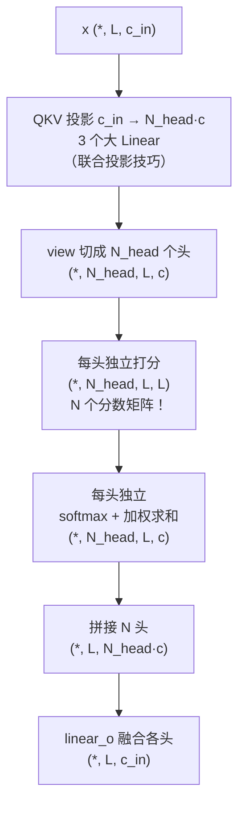

---
tags:
  - 生物
  - AlphaFold
---

> [!note] 本节要点
> - 单头、多头、Global 注意力是同一套缩放点积公式的三个档位，差别只在头数、query 是否平均、K/V 是否共享；
> - 多头在宽度守恒下不额外增加参数；Global 用 query 平均 + K/V 单头共享把列注意力的 S×S 降到 O(S)，代价是序列之间不再两两交流；
> - Gate 不是第四种形态，而是挂在注意力输出上的逐通道可学习软阀门，作用维度与注意力权重完全不同。

本文配合 alphafold-decoded 第 3 课（`attention.ipynb`）及后续课程阅读，代码引用均指向 `solutions/` 目录。

本文是上篇——把注意力的**机制**讲透：单头、多头、全局、门控，全部由同一套公式 softmax(QKᵀ/√c)·V 的不同配置变出来；含对比总表与 6 道自查题。 **下篇**《AlphaFold 中的注意力详解》（同目录 `af2_attentions.md`）先补 m / z / s 三种表征的扫盲，再按 AF2 的每一种注意力逐一拆解（算法 7、8、13/14、19、17）。 所有代码引用指向 `solutions/` 目录。建议读完上篇再进下篇。

---

## 上篇：机制

### 0. 先记住结论：多种形态，一套公式

所有形态的核心公式**完全相同**，都是缩放点积注意力：

$$
\operatorname{Attention}(Q,K,V)=\operatorname{softmax}\!\left(\frac{QK^\top}{\sqrt{c}}\right)V
$$

差别只在“配置”——几个旋钮的不同拧法：

| 旋钮                  | 档位    | 得到的形态                    |
| ------------------- | ----- | ------------------------ |
| 头数 N_head           | 1     | 普通的 Attention（单头）        |
| 头数N_head            | >1    | Multi-Head Attention（多头） |
| query 是否平均、K/V 是否共享 | 平均+共享 | Global Attention         |
| 门控 gated            | 开 / 关 | 不新增形态：给输出加一个可学习软阀门（见 §5） |

所以它们不是几种算法，而是**同一机制的几个档位**。这正是 `mha.py` 用一个类加 `N_head`、`is_global`、`gated` 三个参数就能全部实现的原因。

### 1. 共同的地基：注意力 = 可微分的加权检索

#### 1.1 Q / K / V 的直觉

| 角色       | 含义         | 一句话         |
| -------- | ---------- | ----------- |
| Q（query） | 我在找什么      | 你向图书管理员描述需求 |
| K（Key）   | 我这里有什么（标签） | 每本书书脊上的标签   |
| V（value） | 匹配后实际给你的内容 | 书的正文        |

拿 Q 和所有 K 比对 → 得到匹配分数 → softmax 归一成百分比 → 按百分比混合所有 V。

#### 1.2 手算一个最小例子

设每个向量 2 维（c=2），序列里只有 2 个位置：

```text
query      q  = [1, 0]
key₁          = [1, 0]     value₁ = [2, 0]     ← 和 q 方向相同（相似）
key₂          = [0, 1]     value₂ = [0, 2]     ← 和 q 正交（无关）
```

**① 打分**（点积 = 相似度）：`q·k₁ = 1, q·k₂ = 0`；除以 √c = √2 ≈ 1.41 → `0.71, 0`

**② softmax**：`e^0.71≈2.03, e^0=1` → 权重 `[0.67, 0.33]`

**③ 加权汇总**：`out = 0.67×[2,0] + 0.33×[0,2] = [1.34, 0.66]`

输出偏向 value₁（key₁ 和 query 相似），但混入了一点 value₂——“软性检索”：不是只返回一本书，而是按相关度把所有书掺一份给你。

#### 1.3 为什么要除以 √c

点积是 c 项乘积之和，维度越高数值天然越大（大致按 √c 增长）。分数太大 → softmax 接近 one-hot、梯度趋近 0 → 训练不动。除以 √c 把分数方差拉回稳定区间。对应 `mha.py:226`。

### 2. 普通 Attention：单头（`N_head=1`）

**x (\*, L, c_in) → QKV 各一套投影 c_in→c → 打分 (\*, L, L)（全序列只有 1 个分数矩阵）→ softmax + 加权求和 (\*, L, c)**

它就是 `MultiHeadAttention` 在 `N_head=1` 时的退化形式。

- **优点**：最简单、参数最少（约 4·c_in²，见 §6），信息流完整——每个位置都能和所有位置两两交流。
- **瓶颈**：**一套 QKV 权重只能学会一种“关注模式”**。一个头必须用同一种打分方式同时回答“谁和谁空间靠近”“谁和谁同属一条链”……互相干扰，最后每样都学一点、每样都不精。

蛋白质里需要多种关系同时追踪——这是引入多头的动机。

### 3. Multi-Head Attention（多头）

#### 3.1 机制



每个头在自己的 c 维子空间里问一个问题：头 A 专管“空间邻近”，头 B 专管“β 链共线”……拼接后 `linear_o`（永远带 bias，`mha.py:59`）把各头结论重新融合。

#### 3.2 联合投影技巧

理论上是 N_head 组独立 QKV 矩阵，实现上只需 3 个输出通道为 `N_head·c` 的大 Linear，再 `view` 切开——数学等价，GPU 上一次大矩阵乘远快于 N 次小乘：

```python
self.linear_q = nn.Linear(c_in, c*N_head, bias=False)   # mha.py:53
```

> [!question] `use_bias_for_embeddings` 是干嘛的？
> 它只管 Q/K/V 三个投影**要不要带偏置项 b**（`linear_o`/`linear_g` 不受它管，永远带）。AlphaFold 取 **False**：把打分展开 (W_q x_i + b_q)·(W_k x_j + b_k)，四项里 b_q·b_k 是全局常数、x_i W_qᵀ b_k 在行内是常数——都被 softmax 抵消，剩下的信息量很小。更深的是**哲学一致性**：AF2 已有显式的“先验注入通道”——`bias` 参数（pair bias、相对位置），Q/K/V 保持**纯内容投影**，所有非内容影响都走显式 bias 通道，不藏在投影偏置里（现代 LLM 如 LLaMA 干脆删掉全部线性层 bias，与 AF2 同向）。`linear_o` 保留 bias 是因为输出要写回残差流，需要偏移自由度。课程里 `sentiment_analysis.py` 和 notebook 练习传了 True——那是经典 Transformer（2017）“处处带 bias”的约定，让你两种都亲手摸过。

#### 3.3 逐步数据流图

torchview 追踪的真实前向（一个薄包装器包住 `MultiHeadAttention(64, 16, 4, gated=True)`，以便把 bias 的来路也画进去）。**右路就是 bias 的一生**：`输入 z（pair 表征）→ ZLayerNorm → PairBiasProj（每头一份）→ moveaxis 出厂对齐 → view 中间插 1 → add ★`——“z 的先验在这里进入打分”这个 ★ 节点，就是 §3.5 说的注入口（完整三问见下篇 §2.1）。左路是常规的 QKV → 打分 → softmax → 加权汇总 → 拼头 → 门控 → 输出：

![[MHA 数据流 2.png]]

#### 3.4 多头的参数量是“免费”的吗？

| 方案          | 每头维度              | 参数量              | 相对单头    |
| ----------- | ----------------- | ---------------- | ------- |
| 单头          | c = c_in          | ≈ 4·c_in²        | 1×      |
| **多头·宽度守恒** | c = c_in / N_head | **同样 ≈ 4·c_in²** | 1×      |
| 多头·加宽       | c = c_in          | ≈ 4·N_head·c_in² | N_head× |

**宽度守恒**（`N_head·c = c_in`）是标准做法：多头不多花一个参数，只是把同样宽的投影切成 N 份并行，“多样性”免费。Transformer 原文（512 维、8 头、每头 64）和本 repo 全是这种：

| 本 repo 模块        | 输入维度    | 每头 c | 头数  | N_head * c |
| ---------------- | ------- | ---- | --- | ---------- |
| Evoformer 行/列注意力 | c_m=256 | 32   | 8   | 256 ✓      |
| 三角注意力            | c_z=128 | 32   | 4   | 128 ✓      |
| Extra MSA 全局列注意力 | c_e=64  | 8    | 8   | 64 ✓       |

> “行/列”指注意力沿 MSA 表格（S 条序列 × R 个残基）的哪个方向走，图解见 §4.0。

#### 3.5 bias 参数：怎么把先验加进打分（广播细节）

**语义一句话**：`bias` 加在 softmax **之前**的打分上，等于给每对 (i, j) 的“关注度”注入先验。这是**所有 Transformer 的通用机制**，不限于 AlphaFold。

**先分清两条路线：“位置信息”从哪进模型？**（“位置编码”这个词被两条路共用，是混淆之源）

- **输入端加性路线（embedding 侧）**：进网络**前**加到词嵌入上——2017 原文的正弦绝对位置编码就在这里（BERT/GPT 的可学习位置 embedding 同属此路）。**它不是 bias，也和打分无关**——注意力只能从输入表示里间接感知位置。
- **打分端路线（attention 侧，= 本节的 bias 家族）**：直接加在 QKᵀ 打分上，进 softmax 前生效。

**打分端 bias 家族的例子：**

- **T5 相对位置偏置**（2020；思想源头 Shaw 2018 / Transformer-XL 2019；2017 原文没有）：相对距离分桶，每桶一个可学习标量——“离得近的 token 更值得看”；
- **ALiBi**：固定的线性距离衰减，远距离天然降权；
- **padding mask**：给无效位置的分数加 −1e8；
- **AlphaFold 的 pair bias**：relpos（残基索引差分桶，与 T5 几乎同款）→ 编进 z 初始特征 → 经 `linear_z` 变成 bias 回灌打分。比 T5 更进一步：偏置不是静态查找表，而是从**可学习的 pair 表征**里现算的（作用 / 来源 / 梯度三问见下篇 §2.1）。

上篇只需记住：**bias 通道 = 打分的“先验注入口”**，它与 Q/K/V 的内容匹配项相加后一起进 softmax——内容决定底线，先验做加减分。

难的不是语义，是**形状对齐**。分数张量是 `(*, N_head, q, k)`，而 bias 常常比它**少几根前导轴**。真实例子（行注意力，B=2、S=4、R=5、8 头）：

```text
分数 a          (2, 4, 8, 5, 5)      ← B, S, N_head, R, R
z 来的 bias     (2,    8, 5, 5)      ← B, N_head, R, R —— 没有 S 维！
```

bias 没有 S 维，但语义上**同一份 pair bias 对每条序列都适用**——所以解法是：给 bias 补一根长度为 1 的轴，让广播机制自动把它复制到 S 上。`mha.py:229-234` 逐行拆：

```python
bias_batch_shape = bias.shape[:-3]              # 去掉末 3 维 (N_head,q,k) → (2,)，剩 bias 自带的批量维
n = a.ndim - len(bias_batch_shape) - 3          # 分数比 bias 多几根轴？5-1-3 = 1（就是 S 轴）
bias = bias.view(*batch, (1,)*n, N_head, q, k)  # 中间插 1 → (2, 1, 8, 5, 5)
a = a + bias                                    # 广播：size-1 自动扩成 4，每条序列用同一份 bias
```

**为什么 1 插在“中间”（批量维之后、N_head 之前）？** 因为对齐规则是“前导维对前导维、末 3 维对末 3 维”，插进去的 1 恰好填补中间缺口；要是把 1 插在最前面（变成 `(1, 2, 8, 5, 5)`），2 就会对上分数的 S=4——维度错配直接报错。**为什么写成通用的 `n`？** 因为这个类被 5 种场景复用、分数秩不同：行/三角注意力 5 维（n=1），情感分析的 4 维分数配 4 维 bias（n=0，一根都不插）——`n` 自动适配所有调用方式。

### 4. Global Attention：多头 + “全局”档

#### 4.0 前置概念：什么是“行注意力 / 列注意力”？

> [!note] 先对齐任务
> AlphaFold2 的输入是**蛋白质的氨基酸序列**（不是 RNA！）——一串字母如 `MKTAYIAK…`，每个字母是一种氨基酸（L=亮氨酸、V=缬氨酸、S=丝氨酸、T=苏氨酸……，共 20 种）。输出是**每个氨基酸在 3D 空间中的坐标**，即链折叠成的形状。它不生成新序列——注意力在这里不是“写字”用的，而是用来推理“哪些残基对在空间接触”，这决定了链怎么折叠。

![[AlphaFold2 的任务.png]]

![[行-列注意力图解.png]]

MSA（多序列比对，第 4 课正式登场）张量 m 可以看成一张二维表：**S 行 = S 条序列**（人、鼠、鱼……各自版本的同一个蛋白），**R 列 = R 个残基位置**。对这张表有两个互补的注意方向：

> [!info] 形状备忘
> 代码里 m 的完整形状是 `(B, S, R, C)`——B = batch（一次并行处理多少个**不同的蛋白**），S = MSA 表的行数（**序列条数，不是 batch size！**），R = 表的列数（残基数/蛋白长度），C = 每个残基的通道数。本文举例常写 `(S, R, 256)`，是省略 B（batch=1）后的简写。

> [!question] 追问：S 为什么不干脆合并进 batch？
> 因为两者语义和数学角色都不同：**batch 元素之间从不交流**（这是并行加速的前提），而 **S 行之间必须交流**（列注意力的全部意义）——把 S 并进 batch，列注意力直接消失，模型退化成每条序列独立预测。对结果的影响也不同：调 batch 不改变每个蛋白的预测结果（纯吞吐参数；AF2 全程用 LayerNorm 而非 BatchNorm，正为保证这一点），调 S 改变证据量、预测质量真会变——S 是生物学属性：热门蛋白有上万条同源序列，孤儿蛋白可能只有它自己。训练/推理时 512/5120 只是上限配置：训练每次随机抽一个子集（兼作数据增强），推理**可以改**——权重不依赖 S（没有沿 S 的位置编码），喂更多序列通常更准也更慢；极端 S=1（只剩目标序列自己）时准确率大跌，这是 AlphaFold 对孤儿蛋白/人工设计蛋白的软肋。深层原因一句话：**Transformer 的权重只记通道间的变换规则，不记轴的长度**——B、S、R 在推理时都可调，受约束的只有显存。

> [!warning] 缩写撞车预警
> 此处的 MSA = **M**ultiple **S**equence **A**lignment（多序列比对，是**数据**）；而 Transformer/视觉论文（如 ViT）里的 MSA 常指 Multi-head Self-Attention（多头自注意力，是**机制**）。AlphaFold 语境下 MSA 一律指前者——最好玩的是，这张 MSA 表在 Evoformer 里恰好是被“多头自注意力”处理的（行/列注意力都是它），两个 MSA 在同一行代码里相遇。

- **行注意力**：固定一条序列，让**同一行内**的残基互相关注——“这条蛋白内部，位置 i 该看位置 j 吗”。打分矩阵 R×R。
- **列注意力**：固定一个残基位置，让**同一列内**的序列互相对照——“在这个位置上，各物种分别进化成了什么”。打分矩阵 S×S。

本文的 global 版本就是对**列注意力**的廉价改造；两者的完整展开在下篇 §8、§9。

> **一句话点破**：行/列注意力是同一个 `MultiHeadAttention` 类，**只差一个 `attn_dim` 参数**（`msa_stack.py:31` vs `:86`）——它决定把输入张量的哪根轴搬到“query/key 轴”上（`prepare_qkv` 第一行 `movedim(attn_dim, -2)`）。`attn_dim=-2` → 沿 R 轴 → 行注意力；`attn_dim=-3` → 沿 S 轴 → 列注意力。之后所有注意力公式一概不改。

#### 4.1 Global Attention 解决什么问题：列注意力必须有，但 S×S 会爆

**第一问：列注意力为什么非有不可？**

列注意力在**每个残基位置**上让 S 条序列互相对照（§4.0 图里的绿色列）。它承载的是 AlphaFold 最核心的证据——**共进化**。看一个 4 条序列的微型例子：

| 序列   | 位置 37 | 位置 54 |
| ---- | ----- | ----- |
| 序列 1 | L     | V     |
| 序列 2 | L     | V     |
| 序列 3 | S     | T     |
| 序列 4 | S     | T     |

单看任何一条序列，“37=L 配 54=V”只是孤立事实；单看每一列，变异也像随缘。但把行并排放：L↔V 和 S↔T 严格锁定——**协同突变**，意味着这两个位置在 3D 结构里相互接触（一个突变另一个必须补偿）。这种“列与列的相关性”是跨序列的统计：**单条序列在每个位置只贡献一个样本**，不沿序列轴交流就永远看不见。而没有列注意力，每条序列在 Evoformer 里各自为政，MSA 拼成一张大表就白拼了——不如只喂一条序列。（完整论证见 §9.1。）

> [!warning] 易误读：相关的对象是“位置对”，不是“序列对”
> 把 MSA 想成一份问卷——每条**序列**是一份答卷（样本），每个**位置**是一道题（变量）。我们找的是“哪两道题的答案总在联动”（位置 37 和 54 协同变异 ⇒ 这两个残基在 3D 接触），而不是“哪两份答卷长得像”。序列只是证据来源，最终产出的是**残基对关系**——它才是后面折叠时的依据。

> [!question] 追问：37 和 54 都是位置，“位置对相关”为什么反而不是行注意力的功劳？
> 因为“注意力沿哪根轴做”和“最终发现什么关系”是两回事。协同变异的证据**藏在行与行之间**：任何单行内部只有“37=L、54=V”的孤立事实，而行注意力每次只读一行，原则上接触不到跨行的联动统计。能看见它的是**列方向的机制**——列注意力备料 + 外积均值跨序列统计（完整链条见 §9.1）。行注意力的角色是**消费者**：z[37,54] 提炼好之后作为 bias 回灌，告诉它“读位置 54 时多留意位置 37”。一句话：**行/列的名字只描述作用轴，不描述发现对象；生产者在列方向，消费者在行方向。**

所以结论是：**列注意力不能删，问题只是它太贵。**

**第二问：它有多贵——S×S 为什么会“爆”？**

先看 S×S 从哪来。列注意力的任务是**在每个残基位置**让 S 条序列两两交流：每条序列的 query 都要给 S 条 key 打分，打分矩阵就是 S×S。“两两交流”天然是平方级的——S 翻倍，序列对的数量×4。

再算一笔具体的账（以 AF2 官方配置为参考：主 Evoformer 每次喂 **512** 条序列，Extra MSA 喂 **5120** 条——原始数据库检索可达十万级，先进 extra 池子再裁；取 300 个残基、8 头、fp32、batch=1，算**一层**注意力）：

| 项目               | 普通列注意力，S=512 | 普通列注意力，S=5120     | global, S=5120           |
| ---------------- | ------------ | ----------------- | ------------------------ |
| 打分数 = 8头×300位×S² | ≈ 6.3 亿      | ≈ **630 亿**（×100） | 8头×300位×**1**×S ≈ 1230 万 |
| 分数张量显存（×4字节）     | ≈ 2.5 GB     | ≈ **250 GB** ✗    | ≈ **49 MB**              |
| 复杂度              | O(S²)        | O(S²)             | O(S)                     |

**真正的硬墙是显存，不只是时间。** 那 250 GB 不是“算得慢”，是“放不下”——softmax 要把整行分数现成地摆在显存里，反向传播还必须把分数矩阵保存下来算梯度；40~80 GB 的顶级 GPU 连一步都迈不出去（OOM）。时间上虽然只是×100（每块秒级），但乘上 Extra MSA 的 4 个块、4 轮 recycling、训练 batch 再放大几十倍，也够喝一壶。

于是要求就很明确了：**保留“跨序列对照”的功能，把 S×S 的代价打下来**——这正是 global attention（§4.2）要干的事。AlphaFold 敢在旁路里堆十万级序列的 MSA，不是它算得动 S²，是它**绕开了 S²**。

> [!question] 延伸：LLM 上下文都到 1M token 了，它们的 L×L 注意力不也该爆吗？
> 会爆，且被两条路线治着。先修对应关系：LLM 没有 MSA，上下文长度对应的是本文的 **R 轴**（位置/链长）——“LLM 上下文注意力”的蛋白质对应物是行注意力；蛋白质先在 S 轴遇到爆炸，只因为数据天性 **R 短 S 长**。路线一（主力）：**FlashAttention** 让 L×L 矩阵从不被完整写进显存（分块 + 在线 softmax，只写回 L×d 输出），显存 O(L²)→O(L)——正好拆掉上文说的“显存硬墙”，但计算量仍是平方，故 1M 上下文至今又贵又慢。路线二：**改数学**——滑窗、稀疏、线性注意力/Mamba；Nyströmformer 的 landmark 平均与“query 平均成一行”是直系亲戚，global attention 算是这条线的先驱之一。AF2 在 2021 年（FlashAttention 之前）面对训练场景（×batch×48 块×4 轮）选择了路线二；今天蛋白质界的重实现（OpenFold）也写了 memory-efficient attention 内核，把路线一用在保精确的行注意力上。平方爆炸是 Transformer 的原罪，各家按约束选活法。

#### 4.2 Global Attention 机制：两处简化（`mha.py:117`）

1. **query 平均成一行**（`mha.py:151` `torch.mean`）：把 S 行 query **逐元素平均**成 1 行 q̄——S 个“个人问题”（我该参考谁？）塌缩成 1 个“集体问题”（这一列整体该参考什么？）。打分从 `(N_head, R, S, S)` 变成 `(N_head, R, 1, S)`，复杂度 **O(S²) → O(S)**。

    先学会这个形状：`(N_head, R, S, S)` = 每个头 × 每个残基位置，都有一张“序列 × 序列”的两两对照表。

    | 维度           | 含义                        |
    | ------------ | ------------------------- |
    | `N_head`（=8） | 第几个头——8 个头权重独立，各打各的分      |
    | `R`（=300）    | 第几个残基位置——每个位置独立做一遍        |
    | 第 1 个 `S`    | query 序列编号（**谁在提问**）——表的行 |
    | 第 2 个 `S`    | key 序列编号（**谁被参考**）——表的列   |

    任取一个元素 `score[头3, 位置100, 序列5, 序列200]`，读作：“在第 3 个头、第 100 个残基位置上，序列 5 对序列 200 的关注度”。softmax 沿**最后一维**：固定（头，位置，提问者 i）的那一行归一化成概率分布——“序列 i 把注意力怎么分给所有人”。分数总量 8×300×512×512 ≈ 6.3 亿，正是 §4.1 表里的数。global 版 `(N_head, R, 1, S)` 的读法：第 1 个 S 变成 1（提问者平均成一人），第 2 个 S 原封不动（仍要扫过每条序列）——每张对照表从 512 行塌成 1 行。

    > [!warning] 两个 S 都是序列编号（提问者 / 被参考者），不是“序列 × 残基”
    > 打分矩阵遵循一条通用规则：**永远是「提问者总体 × 被参考者总体」**——行注意力是残基对残基 → R×R；列注意力是序列对序列 → S×S（矩阵是方的，因为同一批序列身兼两职，对角线是“自己看自己”）。残基不在打分矩阵里——它们排在 R 维上，每个残基位置有自己独立的一张 S×S 表。MSA 那张 S 行 × R 列的表是**输入数据**，S×S 打分矩阵是**中间产物**，两者别混为一谈。

    迷你例子（S=3，盯住一个残基位置、一个头；v 用标量便于口算）：

    ```text
    q₁=[1,0] q₂=[0,1] q₃=[1,1]   k₁=[1,0] k₂=[0,1] k₃=[1,1]   v₁=2 v₂=4 v₃=6
    普通：9 个分数，每条序列一行专属权重，3 份个性化输出
    global：q̄ = [2/3, 2/3]，只有 3 个分数 q̄·k = [2/3, 2/3, 4/3]
            softmax ≈ [0.25, 0.25, 0.49]
            列总结 ≈ 0.25·2 + 0.25·4 + 0.49·6 ≈ 4.48
            同一行权重、同一个输出，广播给 3 条序列
    ```

    分数从 S² 个变 S 个、加权求和从 S×S 次变 1×S 次——**少了一维，其余照旧**，这就是 ÷S 的全部来源。代价：每条序列不再有个性化结果，大家共享同一份“列总结”（即 §4.3 的信息变弱）。

2.  **K/V 只用 1 个头、全头共享**（`mha.py:55-57`）：`c_kv = c`，再 `unsqueeze(-3)` 广播给各头。头的多样性完全靠 query 侧——每个头仍有一套自己的 query 权重，提的“汇总问题”各不相同。

    **为什么 K/V 共享了，分数里还有 N_head？** 因为共享的只是 K/V，query 侧仍是 8 个头：q̄ 有 8 份（8 种集体问法），k 只有 1 份，广播 8×1→8 → 分数 `(8, R, 1, S)`。逐元素看：`score[头h, 位置r, 0, s] = q̄_h · k_s`——同一批 key，8 种问法各评一次，得 8 行互不相同的分数；输出也是 8 份不同的总结，拼接过 `linear_o`。若把 query 也砍成单头才会变成 `(1, R, 1, S)`——那时 8 个头完全一样，多头就彻底没意义了。

    **一句话记法：Q = 每头一份、各不相同，每个头取了平均；K/V = 全体一份、共同使用**——8 个头 = 8 个不同的问题，问同一个答案库。两个精确点： ① K/V 不是“原样保留”，而是**生来单头的更小投影**：`linear_k/v` 的输出是 `c`（如 64→8）而非普通版的 `c*N_head`（64→64），产出后塞 1 广播，连切头步骤都没有。代价是 K/V 侧的权重**学不到跨头差异化**（表达被有意压扁，多样性全压在 query 侧）——省参数换来的取舍。 ② 广播只发生在头维、不改变数值：每个头拿到的 K/V 是**同一份张量**，所以 8 行分数的差异只可能来自 8 个 q̄。参数对账：`linear_k` 普通版 64×64=4096，global 版 64×8=512，缩 N_head=8 倍（`linear_v` 同理）——这就是 §4.3 “global 参数反而更省”的具体出处。

#### 4.3 信息代价

序列之间不再两两直接交流，每条序列只是“被一份列总结广播了一下”。信息上更弱，但能吃下巨大的 S——AlphaFold 只在旁路（Extra MSA，4 块）用它。参数上反而更省：c_e=64、8 头、gated 计，普通列注意力约 20,608 参数，global 只有 **13,440**。

#### 4.4 名词辨析

NLP 里（如 Longformer）的 “global attention” 指“某些特殊 token 可看全序列”，机制完全不同。AlphaFold 语境下的 global attention 专指算法 19：**query 平均 + K/V 单头共享**。

### 5. Gate（门控）：挂在输出上的可学习软阀门

#### 5.1 它是什么

Gate 不是第四种形态，而是**可与任何形态组合**的开关。加权汇总完成之后、`linear_o` 之前，用一条 sigmoid 支路对输出做逐通道过滤（`mha.py:62`, `mha.py:247-249`）：

```python
# __init__ 里（gated=True 时才建）：
self.linear_g = nn.Linear(c_in, c*N_head, bias=True)

# forward 里：
g = torch.sigmoid(self.linear_g(x))   # (*, L, N_head·c)，每个元素 ∈ (0,1)
o = g * o                             # 逐元素相乘
```

参数量：`linear_g` 约 c_in²（带 bias），把模块从 ~4·c_in² 抬到 ~5·c_in²。

注意一个容易看漏的细节：**门控从原始输入 x 出发**（`linear_g(x)`），不是从注意力输出 o 出发——gate 是和注意力平行的一条独立支路，各自看一遍 x，最后在乘法处会合：

![[门控机制.png]]

它在 forward 里的确切位置：

```python
o = torch.einsum('...qk,...kc->...qc', a, v)   # 注意力输出
o = o.transpose(...); o = torch.flatten(...)   # 拼头 → (*, L, N_head·c)
if self.gated:
    g = torch.sigmoid(self.linear_g(x))        # ← 门控支路，从 x 出发！
    o = g * o                                  # ← 在这里过滤
out = self.linear_o(o)
```

#### 5.2 手算一个门控例子

设拼头后有 3 个通道：

```text
o = [ 1.2,  -0.5,  2.0 ]              # 注意力输出
g = sigmoid([-8,  0,  3]) ≈ [0.0003, 0.50, 0.95]
o ⊙ g ≈ [ 0.0004, -0.25, 1.90 ]       # 通道1被关死，通道2放一半，通道3几乎直通
```

#### 5.3 它和注意力权重的区别（最容易混的一点）

| 对比项  | 注意力权重 a         | 门控 g              |
| ---- | --------------- | ----------------- |
| 作用维度 | **key 维**（位置之间） | **通道维**（特征维度）     |
| 归一方式 | softmax，每行和为 1  | sigmoid，各通道独立，无归一 |
| 学到什么 | 这次该**关注谁**      | 算出的信息**放行多少**     |
| 直觉   | 决定去哪些书架取书       | 取回来后每本书读多少——调音台推子 |

#### 5.4 为什么用 sigmoid × 乘法

sigmoid 处处可微、输出天然在 (0,1)，乘法就是“软开关”：训练早期 g≈0.5 不会切断梯度；学好后 g 可长期趋近 0，**关掉没用的通道/头**（可学习的通道稀疏化），趋近 1 则直通。这是深度学习通用套路：LSTM/GRU 的三个门、Highway Network、GLU 全是“sigmoid 阀门 × 信息流”的变体。

#### 5.5 AlphaFold 里的地位

门控是 AF2 论文的正式设计：算法 7 的官方名称就是 **“MSA row-wise _gated_ self-attention with pair bias”**，算法框里明确画了 `g = σ(G_h m_i)`；算法 8、13、14、19 同样带门。本 repo 四处注意力全部 `gated=True`（IPA 例外——它用另一套“每头可学习权重 γ”替代，见 §12）。

#### 5.6 别混淆

NLP 圈 “Gated Attention” 还有别的指代：语音 GSA 里门混合旧状态与注意力输出；Gated Linear Attention（GLA）的门是数据依赖的衰减门。思想同源，机制不同。

**也别和 MoE 划等号**。判据一句话：**门后有没有别的计算？** AF gate 门后没有——`o = g·o` 时该算的都算完了，门只是给输出通道装音量旋钮（过滤，不省算力）。MoE 门后是各算各的专家子网络——路由器决定谁开工，top-k 只让被选中的专家运行（条件计算，扩容量不增算力，这正是 MoE 的存在意义）。归一化也不同：AF 用 sigmoid（各通道独立、无竞争），MoE 用 softmax+top-k（专家竞争抢 token）。家谱上确系近亲：MoE 开山论文的门控就是 noisy top-k sigmoid；而和 AF gate **同款模式**的其实是 LLaMA FFN 里的 SwiGLU——`silu(W₁x) ⊙ (W₃x)`，逐通道的门乘另一条投影。家谱：“学习的门 × 信息流”（LSTM 门控）分两支——逐通道过滤支（Highway → GLU → SwiGLU → AF gate）与路由选择支（局部专家 → 稀疏 MoE → Mixtral）。

### 6. 上篇正面对比总表

| 维度           | ① 普通 Attention | ② Multi-Head Attention | ③ Global Attention  |
| ------------ | -------------- | ---------------------- | ------------------- |
| 头数           | 1              | N_head（本 repo 4~8）     | N_head，但仅 query 侧分化 |
| K/V          | 1 套            | 每头 1 套                 | **全头共享 1 套**        |
| query        | 1 套            | 每头 1 套                 | 每头 1 套，**再沿查询维平均**  |
| 打分矩阵         | 1 个 (L×L)      | N_head 个 (L×L)         | N_head 个 (**1×S**)  |
| 复杂度（打分）      | O(L²)          | O(N_head·L²)           | **O(N_head·S)**     |
| 参数量（宽度守恒时）   | ≈4·c_in²       | **同样 ≈4·c_in²**        | 更少（K/V 缩 N_head 倍）  |
| 表达力          | 一种关注模式         | 多种模式并行                 | 多种“总结视角”，无两两互动      |
| 信息流          | 两两交流           | 两两交流                   | 单向广播式总结             |
| 门控 gate      | 可选             | 可选，本 repo 全开           | 可选，全开               |
| 典型用途         | 教学/极简模型        | 几乎所有主流模型               | 超长序列的廉价层            |
| AlphaFold 位置 | 教学基线           | 算法 7/8/13/14           | 算法 19               |

> 算例感受 global 的价值：S=2000 条序列、R=300 残基、8 头。普通列注意力每层打分 300×2000×2000×8 ≈ **96 亿次**；global 每层 ≈ **480 万次**。相差 S=2000 倍。

> [!warning] 下篇还没写进仓库
> 本篇只覆盖上篇（§0–6，机制）；文中提到的下篇《AlphaFold 中的注意力详解》（`af2_attentions.md`）尚未加入。

相关笔记：[[AlphaFold 课程总览|AlphaFold 课程总览]]　·　[[4. Strengths and limitations of AlphaFold 2|AlphaFold 2 的强项与局限]]
