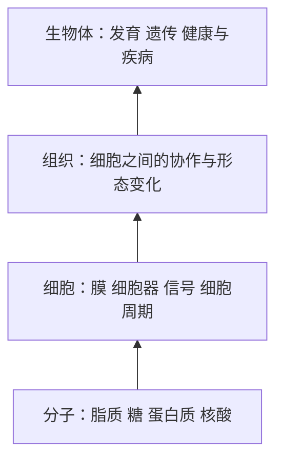

https://www.youtube.com/watch?v=KlVHqq38KJU
## 1. 这门课要解决什么问题
- 生物学已经从传统的分类、解剖，发展成以分子为基础的科学。
- 现代生物学融合了化学、物理、数学、计算机科学和工程学。    
- 不同生物虽然外形差异巨大，但共享许多基本分子和机制。
- 学习简单系统中的基本规律，可以逐步理解复杂的细胞、组织和人体。
可以把整门课看成从下到上的四个层次：

## 2. 为什么要学习现代生物学

学习生物学的现实意义包括：
1. **理解健康与疾病** 
	许多疾病的起因已经可以追溯到基因、蛋白质或细胞信号通路。
2. **理解新疗法** 
	精准医疗、癌症基因组学、基因治疗和免疫治疗，都依赖分子层面的知识。
3. **理解系统生物学** 
	可以把细胞看成一个复杂的网络：蛋白质彼此作用，信号被放大或抑制，最终产生细胞行为。
4. **理解合成生物学** 
	利用细胞制造药物、材料或其他有用分子。
5. **参与伦理判断** 
	基因编辑、克隆、遗传检测、设计婴儿和基因隐私，都需要基本生物学知识。

“系统生物学”和“合成生物学”可以这样区分：

| 方向 | 核心问题                  |
| ------------------------------- | --------------------- |
| 系统生物学                           | 一个细胞或生物体内部的组件如何连接和协作？ |
| 合成生物学                           | 能否重新设计或利用生物系统来完成某项功能？ |

## 3. 生命可能如何起源
教授用一条时间线介绍生命起源：
1. **前生物世界**
	早期地球经历高温、火山和复杂的化学反应。简单分子逐渐形成更复杂的有机分子。
2. **前 RNA 世界**
	在真正的细胞出现以前，可能已经有了核酸样分子。它们可能具有有限的复制或催化能力。
3. **RNA 世界**
    RNA 很特别，因为它既能储存信息，又能催化某些化学反应。因此一种假说认为，早期生命可能主要依赖 RNA，而不是蛋白质。
4. **膜和细胞**
	真正的细胞需要一个边界。脂质双层膜把“内部”和“外部”分开，使细胞能够：
	- 保留有用分子；
	- 建立离子梯度；
	- 控制物质进出；
	- 在内部进行彼此协调的反应。

膜的出现是生命复杂化的关键一步。
## 4. 从原核生物到真核生物
早期细胞大致可分为两类：
1. **原核细胞**
	例如细菌，通常具有：
	- 没有细胞核；
    - 内部区室较少；
    - 体积较小；
    - 结构相对简单。
2. **真核细胞**
	例如动物、植物和真菌，通常具有：
	- 细胞核；
    - 多种细胞器；
    - 更大的体积；
    - 更复杂的内部运输和信号系统。

真核细胞通常比细菌大很多。体积增大带来更多功能，但也带来更复杂的问题：
- 分子如何运输？
- 信号如何传递到正确位置？
- 不同细胞器如何协作？
- 细胞如何维持内部环境？

## 5. 进化与分子钟

传统上，人们通过化石、骨骼形态和身体结构研究进化。现代生物学还可以比较基因组。

**分子钟**的基本思想是：
1. 不同物种从共同祖先分开；
2. 分开后，DNA 会逐渐积累突变；
3. 通过比较相同基因或 DNA 序列的差异，可以估计分化时间。

它不能简单地把任意两个物种直接比较，因为不同谱系的突变速率可能不同。但对许多关系较近的真核生物，分子钟非常有用。

一个关键思想是：

> 基因组不仅记录“现在是什么”，也记录“过去如何演化”。

## 6. 人类基因组与基因组大小

人类基因组大约包含 **30亿个碱基对**。注意：

- “碱基对”不是“基因”的数量；
- 人类实际蛋白质编码基因大约只有两万多个；
- 人与人之间约有 99.9% 的 DNA 序列相同；
- 剩余差异可以影响外貌、疾病风险和药物反应等。

不同生物的基因组大小差别很大，但基因组大小不一定和生物复杂程度成正比。这说明：

- DNA 中不只有蛋白质编码区；
- 非编码 DNA 可能参与调控、染色体结构和基因表达；
- “有多少 DNA”与“有多少功能”不是同一个问题。

## 7. DNA结构为什么改变了生物学
DNA 的重要性不只在于它由哪些化学基团组成，还在于它的三维结构。
DNA 双螺旋具有几个关键特征：
- 两条链反向平行；
- 糖—磷酸骨架位于外侧；
- 碱基位于内侧；
- A 与 T 配对；
- G 与 C 配对；
- 两条链可以分开并分别作为复制模板。

这解释了 DNA 如何：
1. 储存遗传信息；
2. 被准确复制；
3. 被转录成 RNA；
4. 通过遗传密码指导蛋白质合成。

现代分子生物学的核心信息流可以写成：

要特别区分三种概念：
- **DNA 复制**：DNA → DNA
- **转录**：DNA → RNA
- **翻译**：RNA → 蛋白质

## 8. 测序技术如何推动生物学

课程强调，现代生物学的发展离不开技术进步。

重要节点包括：
- 1970年代：DNA 测序方法出现；
- 1980年代：荧光标记和自动化测序提高效率；
- 1990年：人类基因组计划开始；
- 2001年：人类基因组草图发表；
- 后来：千人基因组、癌症基因组、单细胞测序和合成基因组相继发展。

现在的挑战已经从“能不能获得数据”逐渐转向：

> 如何解释海量数据，并把序列差异和真实生物功能联系起来？

## 9. DNA 如何装进细胞

每个人类细胞中的 DNA 如果完全拉直，大约有 1.8 米长，但细胞直径只有几十微米。
DNA 能被压缩，是因为它会：
1. 缠绕在带正电的组蛋白上；
2. 形成核小体；
3. 进一步折叠成更高级的染色质结构；
4. 在细胞分裂时形成更加紧密的染色体。
但 DNA 不能永远处于完全压缩状态。细胞需要在两种状态之间切换：
- **压缩**：便于储存和保护；
- **开放**：便于复制、转录和调控。
这引出一个重要问题：
> 一个基因是否被表达，往往不仅取决于 DNA 序列，也取决于 DNA 是否处于可访问状态。

## 10. 细胞大小与尺度
典型尺度：
- 细菌：约 1–10 微米；
- 真核细胞：约 10–100 微米；
- DNA 分子：纳米尺度；
- 人体：米尺度。
生物学经常需要跨越多个数量级。你必须学会在不同尺度间转换：

尺度会影响功能。例如：
- 分子扩散在小细胞中较有效；
- 细胞变大后，需要主动运输和内部区室；
- 多细胞生物需要细胞间信号和组织结构。

## 11. 荧光成像与动态生物学
现代显微技术让科学家可以在活细胞中观察蛋白质的位置和行为。
荧光蛋白可以被连接到目标蛋白上，从而观察：
- 蛋白质在哪里；
- 什么时候出现；
- 什么时候消失；
- 是否随细胞周期发生变化；
- 是否参与细胞分裂或迁移。
这带来一个重要转变：
> 生物学不再只是观察静态结构，也可以直接研究动态过程。

例如，细胞分裂时：
- 染色体会被特定荧光标记；
- 微管会重新组织；
- 不同蛋白质会按时间顺序出现；
- 细胞最终分成两个子细胞。

## 12. 遗传学与个人生活
Martin 教授介绍果蝇作为模式生物。模式生物的价值在于：
- 生命周期短；
- 容易繁殖；
- 基因容易操作；
- 很多基本机制与人类共享。

遗传学不只是实验室知识，也直接影响日常生活：
- 23andMe 等公司可以检测遗传变异；
- 基因数据可以用于祖源分析；
- 某些变异可能提示疾病风险；
- 警方也可能通过公开家族基因数据寻找犯罪嫌疑人。

这里有三个需要区分的概念：
1. **遗传变异**：DNA 序列存在差别；
2. **疾病风险**：某种变异提高概率，不等于必然患病；
3. **实际表型**：最终表现还受环境、生活方式和其他基因影响。

因此，基因检测结果不能简单理解为“命运判决”。

## 13. 细胞信号与动态行为
中性粒细胞追踪细菌的例子说明了细胞信号：
1. 细菌释放或引起某种化学信号；
2. 中性粒细胞检测到信号；
3. 细胞内部发生信号传递；
4. 细胞骨架重新排列；
5. 细胞朝细菌移动并吞噬它。

这体现了“刺激—信号通路—细胞反应”的基本结构：

后续学习细胞信号时，可以始终追问四个问题：
- 信号是什么？
- 由哪个受体接收？
- 哪些分子在细胞内传递？
- 最终改变了什么行为？

## 14. 基因组如何编码身体形状？

虽然我们已经拥有许多生物的基因组序列，但仍然不完全知道：
> 基因组如何让细胞形成特定的组织和身体形状？

果蝇胚胎的例子展示了形态发生：
- 一开始，细胞排列成一层；
- 一部分细胞产生收缩力；
- 细胞形状改变；
- 组织发生折叠；
- 单层结构逐渐形成多层结构。

这不是单个基因直接“画出”身体形状，而是许多过程共同作用：
- 基因表达；
- 蛋白质定位；
- 细胞骨架；
- 细胞黏附；
- 机械力；
- 细胞间信号。

这就是从分子规则到组织形态的“涌现”。

## 15. 细胞分裂与癌症
细胞分裂必须受到严格控制。正常细胞需要判断：
- 是否有足够营养；
- DNA 是否完整；
- 是否收到分裂信号；
- 是否已经完成复制；
- 是否适合进入下一阶段。

如果控制系统失效，可能导致：
- DNA 损伤积累；
- 异常细胞继续分裂；
- 组织结构遭到破坏；
- 最终形成癌症。

因此，癌症不仅是“细胞长得太快”，更是：
> 细胞周期、DNA 损伤检查和细胞死亡程序同时发生失调。

