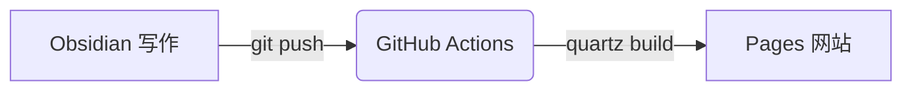

小站开张。这篇同时是写作语法的示范——你能在这里看到所有可用的排版能力，照抄即可。

## 双链

这篇文章用 [[Obsidian]] 写作，用 [[Quartz]] 发布，整体形态是一个 [[数字花园]]。
悬停链接可以预览卡片，点进去之后右侧有反链面板，图谱里也能看到节点。

## 引用与嵌入

> [!note] Callout
> Obsidian 的提示框语法，网站上原样渲染。类型还有 tip / warning / quote 等。

也可以整篇嵌入别的笔记：下面这一块其实是 `![[数字花园]]` 的效果。

![[数字花园]]

## 图表与公式

行内公式 $e^{i\pi} + 1 = 0$，块级公式：

$$
\int_{-\infty}^{\infty} e^{-x^2} \, dx = \sqrt{\pi}
$$

用 Excalidraw 画的图，`![[文件名]]` 嵌进来原样发布：

![[2026-09-17-excalidraw-demo.excalidraw.md]]

## 结语

写作约定（posts 与 notes 的分工、命名规则）在仓库 README 里。开写。
